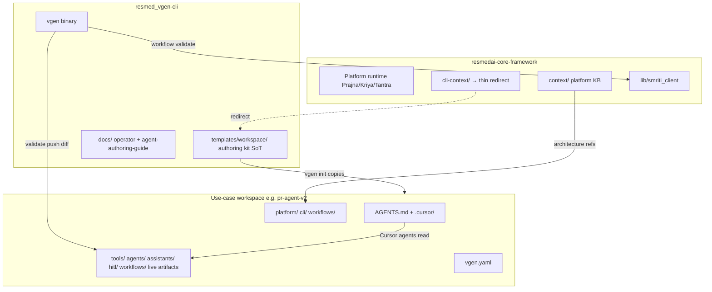
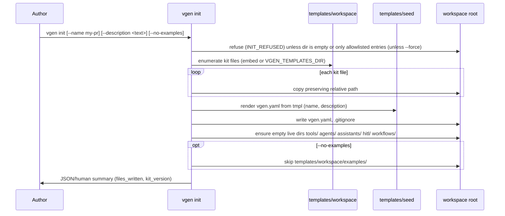

# Authoring kit architecture — CLI repo, init bootstrap, use-case workspace

**Status:** Approved architecture (P2 planning)  
**Repos:** [`resmed_vgen-cli`](../.) · [`resmedai-core-framework`](../../resmedai-core-framework) · use-case workspaces (e.g. [`pr-agent-v2`](../../pr-agent-v2))

---

## 1. Problem statement

Today, ResMate use-case authors must **manually copy** `cli-context/` from `resmedai-core-framework`, rename it, and open it in an IDE. That breaks down when:

- Authors install the CLI via `cargo install` with **no sibling monorepo checkout**
- Docs drift between core `cli-context/`, CLI repo, and live workspaces like `pr-agent-v2`
- `vgen init` (P1) only creates empty dirs + `vgen.yaml` — **no agent KB** (AGENTS.md, skills, platform docs)

P2 moves the **authoring kit** into the CLI repo and makes `vgen init` the canonical bootstrap path.

---

## 2. Design decision: Option A (embedded templates in repo)

| Option | Verdict | Rationale |
|--------|---------|-----------|
| **A — `templates/` tree in CLI repo** | **Chosen** | Maintainable, diffable, testable; copy at runtime or via `rust-embed` for `cargo install` |
| B — git submodule / sparse checkout of cli-context | Rejected | Requires network + sibling repo; poor `cargo install` UX |
| C — download kit tarball on first `init` | Rejected | Extra infra; offline failure modes |

**Binary size:** The full kit is ~100 markdown/JSON files (~1–1.5 MB uncompressed). Acceptable to embed with `rust-embed` or `include_dir!` for release builds. Dev builds may read from `templates/` on disk via `VGEN_TEMPLATES_DIR` to avoid rebuild churn.

---

## 3. Folder layout in CLI repo

```
resmed_vgen-cli/
├── templates/
│   ├── workspace/                 # Authoring kit — copied wholesale on `vgen init`
│   │   ├── AGENTS.md              # Agent entry point (Cursor / Copilot)
│   │   ├── README.md              # Workspace orientation
│   │   ├── STANDALONE.md          # Updated: `vgen init` replaces manual copy
│   │   ├── links.md               # Cross-refs; monorepo paths → CLI/docs URLs
│   │   ├── .cursor/
│   │   │   ├── skills/vgen-use-case/SKILL.md
│   │   │   └── rules/vgen-use-cases.mdc
│   │   ├── platform/              # Execution model, state, ReAct, guardrails
│   │   ├── cli/                   # setup, commands-reference, checklist, push/pull
│   │   ├── tools/                 # KB only (*.md) — live tools added by author/scaffold
│   │   ├── agents/                # KB only
│   │   ├── assistants/            # KB only
│   │   ├── hitl/                  # KB only
│   │   ├── workflows/             # Recipe playbooks (not live workflow defs)
│   │   └── examples/              # Reference samples (optional on init)
│   │
│   ├── recipes/                   # Scaffold-only live artifacts (not part of init kit)
│   │   ├── minimal/
│   │   ├── form-wizard/
│   │   └── oracle-pr/
│   │
│   └── seed/                    # Init-only files (not overwritten from workspace kit)
│       ├── vgen.yaml.tmpl
│       └── gitignore
│
├── docs/                        # CLI operator docs (json-output, mcp-setup, errors/)
│   ├── agent-authoring-guide.md # Short guide; defers platform detail to workspace kit
│   └── AUTHORING-KIT-ARCHITECTURE.md  # This file
│
└── src/
    ├── kit/                     # NEW — load templates, copy tree, variable substitution
    │   ├── mod.rs
    │   ├── embed.rs             # rust-embed / include_dir wiring
    │   └── copy.rs              # Recursive copy with skip/force semantics
    └── scaffold.rs              # MODIFY — recipes read from templates/recipes/
```

### What moves from `resmedai-core-framework/cli-context/`

| Source (core `cli-context/`) | Destination | Notes |
|------------------------------|-------------|-------|
| `AGENTS.md`, `README.md`, `STANDALONE.md`, `links.md` | `templates/workspace/` | Update copy/rename → `vgen init` |
| `.cursor/**` | `templates/workspace/.cursor/` | Skill + rule globs unchanged |
| `platform/**` | `templates/workspace/platform/` | Full tree |
| `cli/**` | `templates/workspace/cli/` | commands-reference updated in P2 PRs |
| `tools/*.md`, `agents/*.md`, etc. | `templates/workspace/tools/` etc. | KB markdown only |
| `workflows/*.md` | `templates/workspace/workflows/` | Recipe playbooks |
| `examples/**` | `templates/workspace/examples/` | Reference samples |
| Live artifact YAML in `examples/*/` | `templates/recipes/*/` | Scaffold sources; not copied on bare `init` |

**Not moved:** Platform runtime code, `context/` KB, smriti fixtures — stay in core framework.

---

## 4. Relationship: core framework vs CLI vs workspace



| Layer | Role | Source of truth (P2+) |
|-------|------|------------------------|
| **Platform runtime** | Executes assistants, agents, tools | `resmedai-core-framework` |
| **Platform architecture KB** | Service contracts, revamp, ADRs | `resmedai-core-framework/context/` |
| **Authoring kit** | How to build use cases; agent instructions | `resmed_vgen-cli/templates/workspace/` |
| **CLI operator docs** | JSON envelope, MCP, error codes | `resmed_vgen-cli/docs/` |
| **Use-case workspace** | Live artifacts + copied kit | Author's project dir after `vgen init` |

---

## 5. `vgen init` bootstrap flow



### Files written by `init`

| Category | Paths | Overwrite on `--force` |
|----------|-------|------------------------|
| **Kit copy** | `AGENTS.md`, `README.md`, `STANDALONE.md`, `links.md`, `.cursor/**`, `platform/**`, `cli/**`, `tools/*.md`, `agents/*.md`, `assistants/*.md`, `hitl/*.md`, `workflows/*.md`, `examples/**` (default) | Kit files yes; live artifacts never deleted |
| **Seed** | `vgen.yaml`, `.gitignore` | Yes |
| **Empty dirs** | `tools/`, `agents/`, `assistants/`, `hitl/`, `workflows/` | Created if missing |

### Files **not** written by `init`

- `.env` — author creates manually (documented in `cli/setup.md`)
- Live tool/agent/assistant/HITL/workflow YAML — added by author or `scaffold`
- `docs/agent-authoring-guide.md` — stays in CLI repo; linked from workspace `README.md`

### Init-safe directory gate

`init` refuses (`INIT_REFUSED`) unless the target directory is **empty** or contains only **allowlisted** top-level entries: `.git`, `.gitignore`, `README.md`, `.DS_Store` (case-sensitive exact names). Any other file or directory — including empty live-artifact dirs like `tools/` — is reported as an offender and blocks init until `--force` is passed. `--force` bootstrap-overwrites kit/seed files but never deletes live artifacts; for refreshing an existing use-case repo, prefer `vgen kit update` (see [agent-authoring-guide.md](./agent-authoring-guide.md#vgen-kit-update-refresh-an-existing-workspace)). The CLI and the MCP `init_workspace` tool share this gate and messaging.

### CLI flags

```bash
vgen init [--name <project>] [--description <text>] [--force] [--no-examples]
```

| Flag | Behavior |
|------|----------|
| `--name` | `vgen.yaml` `name` field; default = cwd basename |
| `--description` | `vgen.yaml` `description` field; default `ResMate use case workspace` |
| `--force` | Bootstrap-overwrite kit/seed in a non-init-safe dir; still refuses to delete author artifacts |
| `--no-examples` | Skip `examples/` tree (~40% of kit file count) |

### `vgen.yaml` generation

Rendered from `templates/seed/vgen.yaml.tmpl`:

```yaml
version: 1
name: {{name}}
description: {{description}}
kit_version: "{{kit_version}}"   # CLI crate version or templates git sha
initialized_at: "{{initialized_at}}"   # RFC3339, e.g. 2026-07-17T09:38:00+00:00
```

Recipe-specific fields (`recipe`, `default_assistant`) are added by `scaffold`, not bare `init`.

---

## 6. `vgen scaffold` vs `vgen init`

| | `vgen init` | `vgen scaffold <recipe>` |
|--|----------------|------------------------------|
| **Purpose** | Bootstrap **authoring environment** (docs + Cursor + empty dirs) | Add **starter live artifacts** for a recipe |
| **Requires** | Empty or allowlisted directory (or `--force` to bootstrap-overwrite) | Init kit present **or** `--with-kit` to run init first |
| **Writes** | Full kit + seed files | Files under `templates/recipes/<recipe>/` only |
| **Recipes** | — | `minimal`, `form-wizard`, `oracle-pr` (+ future) |
| **Idempotent** | Kit refresh with `--force` | Refuses if target artifact paths exist |

**Recommended author flow:**

```bash
mkdir my-pr-agent && cd my-pr-agent
vgen init --name my-pr-agent
vgen scaffold oracle-pr --name my-pr-agent
# edit tools/, push with vgen validate → push-all
```

**MCP / JSON:** `init` and `scaffold` responses include `kit_version`, `files_written`, `recipe` (scaffold only).

### Migrating P1 inline recipes

P1 embeds recipe YAML as Rust strings in `src/scaffold.rs`. P2 moves them to `templates/recipes/<name>/` and deletes inline content. `merge_init_and_recipe` becomes: optional `--with-kit` init + recipe copy only.

---

## 7. What agents read after `init`

Cursor (and similar IDEs) discover instructions from the **workspace root**:

| Priority | File | Purpose |
|----------|------|---------|
| 1 | `AGENTS.md` | Read order, conventions, push order, validate gates |
| 2 | `.cursor/skills/vgen-use-case/SKILL.md` | Skill: develop tools, agents, HITL, workflows |
| 3 | `.cursor/rules/vgen-use-cases.mdc` | Globs on `tools/`, `agents/`, etc. |
| 4 | `workflows/README.md` | Pick a recipe shape |
| 5 | `platform/execution-model.md` + `state-and-workflows.md` | Runtime semantics |
| 6 | `cli/commands-reference.md` + `cli/authoring-checklist.md` | CLI surface + P0/P1/P2 gates |
| 7 | `examples/` | Copy patterns only |

**Update in kit:** `STANDALONE.md`, `cli/setup.md`, and skill step 1 must say **`vgen init`** instead of "copy cli-context from monorepo".

---

## 8. Template loading strategy (binary size)

| Build / install | Kit resolution |
|-----------------|----------------|
| `cargo run` / dev checkout | `CARGO_MANIFEST_DIR/templates/` (filesystem) |
| `cargo install vgen` | `rust-embed` of `templates/` compiled into binary |
| Override | `VGEN_TEMPLATES_DIR=/path/to/templates` |

**Size budget:** Target < 2 MB added to release binary. If `examples/` pushes over budget, split:

- **Default embed:** kit without `examples/`
- **`--with-examples` on init:** copy from filesystem in dev; optional feature flag `full-kit` for release

**Sync test:** `tests/kit_copy_test.rs` — `init` into tempdir, assert `AGENTS.md` and `.cursor/skills/.../SKILL.md` exist.

---

## 9. Migration: core `cli-context/`

**Phase 1 (P2 PR12):** Copy content to `resmed_vgen-cli/templates/workspace/`; core `cli-context/` unchanged.

**Phase 2 (P2 PR19):** Replace core `cli-context/` with redirect stub:

```
cli-context/
├── README.md          # "Authoring kit moved to resmed_vgen-cli. Run: vgen init"
├── AGENTS.md          # Short pointer + link to CLI repo templates/workspace/AGENTS.md
└── MIGRATION.md       # Manual copy → vgen init; pr-agent-v2 refresh steps
```

**Update references:**

| Location | Change |
|----------|--------|
| `resmedai-core-framework/AGENTS.md` | Link to CLI repo authoring kit |
| `context/links.md` | Point cli-context rows to CLI repo paths |
| `.cursor/rules/cli-use-case.mdc` | "Run `vgen init`" not "read cli-context/" |
| `lib/smriti_client/tests/fixtures/README.md` | SSOT: `templates/workspace/examples/*/workflows/` |
| `pr-agent-v2` | Refresh from `vgen init --force` or manual kit sync script |

**No deletion** of core `cli-context/` in P2 — deprecate with redirect to avoid breaking open PRs.

---

## 10. Kit versioning and refresh

- `vgen.yaml` `kit_version` records which kit was applied.
- Future: `vgen kit refresh` (P3+) — merge updated `cli/`, `platform/` docs without touching live artifacts.
- P2 scope: `vgen init --force` overwrites kit markdown only; skips paths where live `tool.yaml` / agent YAML exists (configurable ignore list).

---

## 11. Testing hooks

| Test | Validates |
|------|-----------|
| `kit_copy_test` | Init copies full kit tree |
| `init_no_examples_test` | `--no-examples` omits `examples/` |
| `scaffold_requires_kit_test` | Scaffold without kit fails with remediation |
| `smoke-pr-agent.sh` | Uses `testdata/pr-agent-minimal/` (artifacts only; kit not required for CLI tests) |

---

## 12. Open decisions (confirm at P2 kickoff)

- [ ] **K1:** Embed full kit including `examples/` in release binary — **recommended yes** if < 2 MB; else default `--no-examples` in embed
- [ ] **K2:** `scaffold` requires prior `init` — **recommended yes**, with `--with-kit` escape hatch
- [ ] **K3:** Core `cli-context/` → redirect only in PR19, not PR12
- [ ] **K4:** `pr-agent-v2` refresh via `scripts/sync-authoring-kit.sh` from templates/workspace
