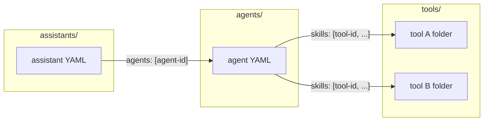

# Developing ResMate Use Cases with the CLI

This document is a standalone reference for developing use cases on the ResMate agent platform using the ResMate CLI. It covers folder layout, YAML semantics, how agents connect to tools and assistants to agents, environment configuration, CLI operations (push and pull), and how to write system context, agent instructions, and JS tool handlers.

---

## Prerequisites

- **ResMate CLI** – Built and available as `resmate` in your path (Rust project under repo root).
- **Configuration** – Set up via a `.env` file in the project root (or cwd) or via a config file. See [Environment and .env](#environment-and-env) below.

---

## Environment and .env

The CLI loads configuration from the environment. A `.env` file in the project root (or cwd) is loaded at startup. Config can also be read from a YAML file (path from `RESMATE_CONFIG` or default `~/.resmate/config.yaml`); **environment variables override** the config file.

### Allowed properties (environment variables)

| Variable | Purpose | Required / Default |
|----------|---------|--------------------|
| `RESMATE_BASE_URL` | API base URL for the ResMate platform. | Optional; default: `https://e9c6-103-169-178-8.ngrok-free.app`. |
| `RESMATE_API_KEY` | API key (or JWT) for authenticating requests. | **Required** for push/pull and `config validate`. |
| `RESMATE_SECRET` | Secret used to sign JWTs for API calls (when using JWT auth). | Required when the client uses JWT. |
| `RESMATE_ROC_SESSION` | Optional ROC session value. | Optional. |
| `RESMATE_CONFIG` | Path to a YAML config file (overrides default `~/.resmate/config.yaml`). | Optional. |
| `RESMATE_IDS_FILE` | Path to the IDs store file (slug → id mapping). | Optional; default: `~/.resmate/ids.yaml`. |
| `RESMATE_TOOLS_DIR` | Directory containing tool folders. | Optional; default: `tools` under cwd. |
| `RESMATE_AGENTS_DIR` | Directory containing agent YAML files. | Optional; default: `agents` under cwd. |
| `RESMATE_ASSISTANTS_DIR` | Directory containing assistant YAML files. | Optional; default: `assistants` under cwd. |

### How to use .env to achieve the use case workflow

1. Create a `.env` file in the repo root (or cwd) with at least:
   - `RESMATE_API_KEY=<your-api-key>`
   - `RESMATE_SECRET=<your-secret>` (if your setup uses JWT auth)
2. Optionally set `RESMATE_BASE_URL` for a different environment (e.g. production).
3. Optionally set `RESMATE_TOOLS_DIR`, `RESMATE_AGENTS_DIR`, `RESMATE_ASSISTANTS_DIR` if your folders live elsewhere.
4. Run `resmate config show` to verify base_url and that api_key is set.
5. Run `resmate config validate` to check connectivity.
6. Use **push** to upload tools/agents/assistants and **pull** to sync from the platform.

**Note:** `.env` is in `.gitignore`; do not commit secrets.

---

## CLI operations (push and pull)

The primary workflow is **push** (local → platform) and **pull** (platform → local). Only these operations are documented here.

### Tools

| Command | Description |
|---------|-------------|
| `resmate tool push <name> [--tools-dir <PATH>]` | Loads `tools/<name>/` (or `<PATH>/<name>/`): `tool.yaml` + handler (and `package.json` for non-JS). If YAML has no `id`, creates the tool via API and writes the new `id` back to the YAML; if `id` is present, updates the tool. Output: `Pushed tool: <id>`. |
| `resmate tool pull <name> [--tools-dir <PATH>]` | Requires `id` in `tools/<name>/tool.yaml`. Fetches the tool from the API and overwrites local YAML, handler, and (if present) `package.json`. Output: `Pulled tool: <name>`. |

### Agents

| Command | Description |
|---------|-------------|
| `resmate agent push <name> [--agents-dir <PATH>]` | Loads `agents/<name>.yaml` (or `<PATH>/<name>.yaml`). No `id` → create and write `id` back; with `id` → update. Output: `Pushed agent: <id>`. |
| `resmate agent pull <name> [--agents-dir <PATH>]` | Requires `id` in the agent YAML. Fetches the agent and overwrites the local YAML. Output: `Pulled agent: <name>`. |

### Assistants

| Command | Description |
|---------|-------------|
| `resmate assistant push <name> [--assistants-dir <PATH>]` | Loads `assistants/<name>.yaml`. No `id` → create and write `id` back; with `id` → update. Output: `Pushed assistant: <id>`. |
| `resmate assistant pull <name> [--assistants-dir <PATH>]` | Requires `id` in the assistant YAML. Fetches the assistant and overwrites the local YAML. Output: `Pulled assistant: <name>`. |

### Config

| Command | Description |
|---------|-------------|
| `resmate config show` | Print current config (base_url, masked api_key, roc_session, config file path, env var names). |
| `resmate config validate` | Validate base URL and API key with a test request. |

Directory overrides (`--tools-dir`, `--agents-dir`, `--assistants-dir`) align with the env vars `RESMATE_TOOLS_DIR`, `RESMATE_AGENTS_DIR`, `RESMATE_ASSISTANTS_DIR` when not passed.

---

## Architecture and connections

### Folder layout

- **`tools/<name>/`** – One folder per tool. Contains:
  - **`tool.yaml`** (or `tool.yml`, `config.yaml`): metadata and spec; **`id`** is the stable tool ID.
  - **Handler:** `handler.js`, `index.js`, `handler.ts`, or `index.ts`. For **type: JS** no `package.json` is required; for other types (e.g. FAAS), `package.json` is required.
- **`agents/<name>.yaml`** – One file per agent. **`id`** = agent ID; **`skills`** = list of **tool IDs** (from `tools/*/tool.yaml`).
- **`assistants/<name>.yaml`** – One file per assistant. **`id`** = assistant ID; **`agents`** = list of **agent IDs** (from `agents/*.yaml`).

### Connection rules

- **Agent → Tools:** In `agents/<name>.yaml`, the **`skills`** array must list **tool IDs**. Each value must match the `id` in the corresponding `tools/<folder>/tool.yaml`.
- **Assistant → Agents:** In `assistants/<name>.yaml`, the **`agents`** array must list **agent IDs**. Each value must match the `id` in the corresponding `agents/<name>.yaml`.

### End-to-end flow (writing a use case)

1. Define **tools** (folder + `tool.yaml` + handler); record each tool’s `id`.
2. Define **agent** (`agents/<name>.yaml`) with `skills` = those tool IDs; write **system instructions** (role, when to use each tool, order, rules).
3. Define **assistant** (`assistants/<name>.yaml`) with `agents` = that agent’s ID; write **system context** (what the assistant is, which agent/tools, scope, errors).

---

## Folder and file reference

### Tools

- **Location:** `tools/<name>/` (or `RESMATE_TOOLS_DIR/<name>/`).
- **Required files:** A single YAML file (`tool.yaml`, `tool.yml`, `config.yaml`, or `config.yml`) and a handler file (`handler.js`, `index.js`, `handler.ts`, or `index.ts`). For type other than **JS**, `package.json` is also required.

**Key fields in tool YAML:**

| Field | Description |
|-------|-------------|
| `id` | Stable tool ID (written back after first push if missing). |
| `name` | Display name of the tool. |
| `description` | Short description. |
| `type` | e.g. `JS` or `FAAS`. **JS** = no `package.json`; FAAS = code + `package.json`. |
| `input_modes` | e.g. `text/plain`, `application/json`. |
| `output_modes` | e.g. `text/plain`, `application/json`. |
| `systemInstructions` | List of strings; when to use the tool, input/output contract, quality rules. |
| `arguments` | Map of argument name → `{ description, required?, type }`. |
| `examples` | Optional list of example prompts. |
| `tags` | Optional list of tags. |

### Agents

- **Location:** `agents/<name>.yaml` or `agents/<name>.yml` (or under `RESMATE_AGENTS_DIR`).

**Key fields in agent YAML:**

| Field | Description |
|-------|-------------|
| `id` | Stable agent ID (written back after first push if missing). |
| `name` | Display name. |
| `slug` | Slug identifier. |
| `description` | Short description. |
| `systemInstructions` | List of strings; role, tool order, when to use each tool, rules. |
| `skills` | **List of tool IDs** (must match `id` in `tools/*/tool.yaml`). |
| `is_public` | Boolean. |
| `roles` | List of role identifiers. |

Other fields (e.g. `version`, `createdBy`, `guardrailsContext`) may appear; see `agents/code-forge.yaml` and `src/specs/agent.rs` for canonical key order.

### Assistants

- **Location:** `assistants/<name>.yaml` or `assistants/<name>.yml` (or under `RESMATE_ASSISTANTS_DIR`).

**Key fields in assistant YAML:**

| Field | Description |
|-------|-------------|
| `id` | Stable assistant ID (written back after first push if missing). |
| `name` | Display name. |
| `slug` | Slug identifier. |
| `description` | Short description. |
| `status` | e.g. `active`. |
| `visibility` | e.g. `private`. |
| `agents` | **List of agent IDs** (must match `id` in `agents/*.yaml`). |
| `systemContext` | String; what the assistant is, which agent/tools, scope, error handling. |
| `guardrailsContext` | Optional. |
| `guardrailsViolationFallback` | Optional. |

---

## Step-by-step use case checklist

1. **Create tool folder(s):** For each tool, create `tools/<name>/` with `tool.yaml` and `handler.js` (or other allowed handler name). Set `type: JS` if no `package.json`; otherwise include `package.json`. Leave `id` empty for a new tool (CLI will write it on first push).
2. **Create or update agent YAML:** Create or edit `agents/<name>.yaml`. Set **`skills`** to the list of **tool IDs** (from each `tools/<folder>/tool.yaml` `id`). Write **system instructions**: role, tool order, when to use each tool, rules.
3. **Create or update assistant YAML:** Create or edit `assistants/<name>.yaml`. Set **`agents`** to the list of **agent IDs** (from `agents/*.yaml`). Write **system context**: what the assistant is, which agent/tools, scope, error handling.
4. **Push:** Run `resmate tool push <name>` for each tool, then `resmate agent push <name>`, then `resmate assistant push <name>`.
5. **Pull (when needed):** To refresh local YAML/handlers from the platform after changes elsewhere, use `resmate tool pull <name>`, `resmate agent pull <name>`, `resmate assistant pull <name>`.

---

## System context vs system instructions

- **Assistant `systemContext`:** Identity (what this assistant is), which agent (and tools) it uses, scope (in-scope vs out-of-scope), and how to handle errors (e.g. do not expose internals). Keep it short and token-efficient; avoid long trigger/greeting/flow details that belong in the agent.
- **Agent `systemInstructions`:** Role, **order** of tools, **when** to call each tool, and rules (e.g. do not call code-gen before form submit). Be precise and step-oriented.
- **Tool `systemInstructions`:** Input/output contract, **when** this tool is used in the flow (e.g. “only after user has submitted the HITL form”), and quality/fallback rules. Align with the agent’s flow.

---

## JS tool handlers (and “fast” services)

- **Handler contract:** The handler receives a **context** (e.g. `context?.input` with the tool arguments). Return a **JSON string** (e.g. `JSON.stringify({ success, message, ... })`). On error, return a JSON object with `success: false` and an `error` message.
- **Optional `agentResponseContext`:** The handler can include an `agentResponseContext` string in the returned JSON; the platform can pass this to the agent to guide how to present the tool result (e.g. “Just return the code block to the user”).
- **Platform APIs:** Handlers may use platform-provided APIs such as `askLLMStructuredOutput` (for LLM calls with a schema) and `queryRecords` (for data queries). See `tools/code-forge-hitl/handler.js` and `tools/api-code-generator/handler.js` for patterns.
- **Type JS vs FAAS:** For **type: JS**, no `package.json` is required; the CLI only uploads the handler code. For **FAAS**, the CLI expects `package.json` and uploads both code and package.json.

Reference implementations:

- [tools/code-forge-hitl/handler.js](../tools/code-forge-hitl/handler.js) – Compose HITL config using LLM and queryRecords, return config + agentResponseContext.
- [tools/api-code-generator/handler.js](../tools/api-code-generator/handler.js) – Generate PL/SQL using askLLMStructuredOutput, return apiCode/fallback and agentResponseContext.

---

## Code Forge as reference use case

The **Code Forge** use case is the canonical example for a two-step flow (HITL form → code generation):

- **Assistant:** [assistants/code-forge.yaml](../assistants/code-forge.yaml) – Code Forge Assistant; `agents` points to the Code Forge Agent ID; short systemContext (identity, agent/tools, scope, errors).
- **Agent:** [agents/code-forge.yaml](../agents/code-forge.yaml) – Code Forge Agent; `skills` lists two tool IDs (ComposeHITLConfig, APICodeGenarator); system instructions describe the two-step flow and when to use each tool.
- **Tools:** [tools/code-forge-hitl/](../tools/code-forge-hitl/) (Compose HITL form), [tools/api-code-generator/](../tools/api-code-generator/) (generate PL/SQL after form submit).

Use these files as the reference when creating or editing use cases.
