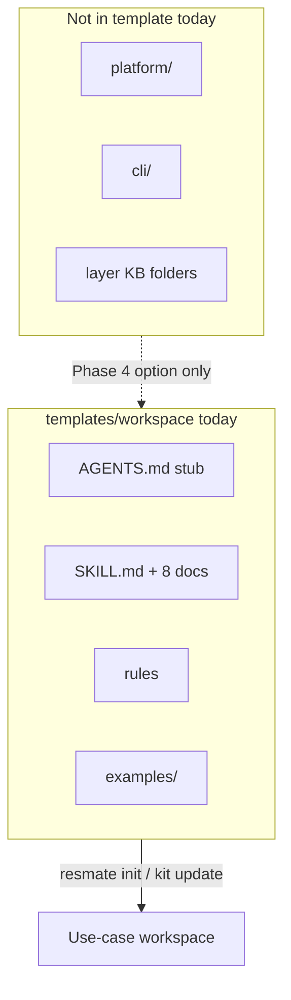
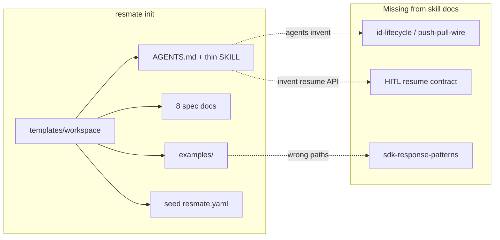
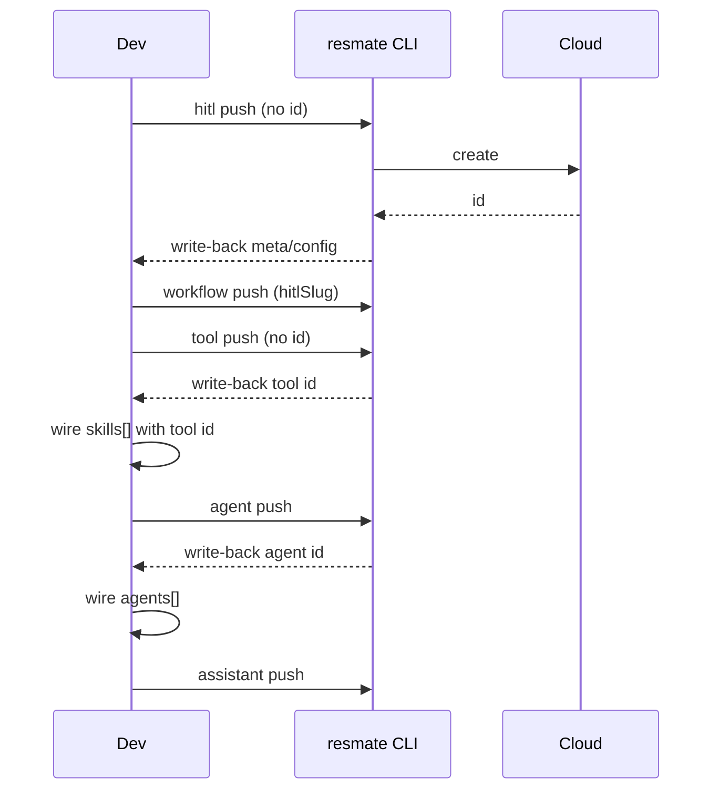

# ResMate CLI `init` / Authoring-Kit Gaps — Developer Plan

**Status:** Plan (investigation complete; implementation not started)  
**Primary repo (only):** `resmed_resmate-cli` — `src/`, `templates/`, `docs/`, tests  
**Out of scope:** Changes in `teemo`, `pr-agent-v2`, `resmedai-core-framework`  
**Audience:** CLI + authoring-kit implementers

Existing use-case workspaces can refresh later via the new **`resmate kit update`** command (see Gap #8 / Phase 1); this plan does **not** list per-repo edits for those workspaces.

---

## Summary / Why this matters

Developers (and Cursor agents) bootstrap a use-case workspace with `resmate init`. That command is the on-ramp for skill, rules, examples, and seed manifest. Seven content/UX gaps share one root cause: init ships a **slim skill-centric kit**, while agents still need full ID lifecycle, SDK response contracts, and HITL resume semantics that are missing from the shipped skill docs.

An eighth gap: once a workspace already has live artifacts, authors need a **safe way to refresh kit files** (skill, rules, AGENTS.md, examples) without a destructive re-init.

Until these are fixed:

- Agents invent Mongo ObjectIds and break push/update.
- Handlers use wrong SDK response paths and fail at runtime.
- HITL resume is treated as a special API instead of a normal chat turn.
- Docs/rules link to missing `platform/` / `cli/` paths and contradict CLI `phase_order`.
- Init emptiness messaging diverges from actual gate behavior.
- Scaffolded repos cannot pick up kit improvements without risky `init --force` (or manual copy).

This plan phases fixes entirely inside **`resmed_resmate-cli`**: quick CLI polish → kit-update command → thicken skill docs (P0 content) → SDK/HITL cookbooks → optional fuller-kit packaging decision.

---

## Packaging approach (skill-only vs packing `cli/` / `platform/`)

### Kit reality today (verified in this repo)

| Source | What it says / does |
|--------|---------------------|
| **`templates/workspace/` (actual ship)** | Slim: `AGENTS.md`, `README.md`, `.cursor/skills/resmate-use-case/` (SKILL.md + 8 `docs/*.md`), `.cursor/rules/`, `examples/`. **No** top-level `platform/`, `cli/`, `tools/` KB trees. |
| **`docs/AUTHORING-KIT-ARCHITECTURE.md`** | Describes a **fuller** kit (`platform/`, `cli/`, layer KB folders) copied wholesale on init — **stale vs current templates**. |
| **`docs/documentation-restructuring-plan.md`** | Intentional move to **skill-as-router** + `docs/` under `.cursor/skills/resmate-use-case/` (matches what ships today). |
| **`scripts/sync-authoring-kit.sh`** | Maintainer rsync from core `cli-context/` → `templates/workspace/` (legacy fuller-tree sync). **Not** the day-to-day author path; do not treat as required for Phases 0–3. |
| **`docs/QUICKSTART.md`** | Mentions future `resmate kit refresh` — aligns with Gap #8. |



### Recommendation for THIS plan (default)

**Primary approach: thicken the shipped skill** under:

```text
templates/workspace/.cursor/skills/resmate-use-case/
├── SKILL.md                          # expand router index
└── docs/
    ├── …existing 8 docs…
    ├── id-lifecycle.md               # NEW (Gap #4)
    ├── push-pull-wire.md             # NEW (Gap #5; aka push-pull-sync)
    ├── sdk-response-patterns.md      # NEW (Gap #6)
    └── hitl-resume-and-message-format.md  # NEW (Gap #7)
```

Also update: `.cursor/rules/resmate-use-cases.mdc` (retarget broken `platform/` links → skill docs), `AGENTS.md` / `README.md` stubs if needed, and `examples/**` teaching samples.

| Decision | Phases 0–3 | Phase 4 |
|----------|------------|---------|
| **Required** | Skill-centric content + CLI/kit-update command | Product choice recorded |
| **Not required** | Restoring full `platform/` + `cli/` trees into `templates/workspace/` | Optional pack of additional top-level doc folders |

**Rationale:** Agents always load the skill after init; ID lifecycle, push/wire, FaaS/SDK, and HITL resume are P0 and fit as focused skill docs. Restoring the historical full KB is larger, conflicts with the restructuring plan’s token-budget goals, and is not needed to close the reported gaps.

Every content fix in this plan must name the **landing path under `templates/workspace/`** (almost always a skill doc), not “sync to pr-agent-v2 / teemo / core.”

### Phase 4 open decision (optional fuller kit)

| Option | Pros | Cons |
|--------|------|------|
| **A. Keep slim skill-centric kit (default)** | Small context; matches restructuring plan; one place for agents | Rule/AGENTS stubs must not link to missing trees |
| **B. Pack additional top-level folders** (`cli/`, `platform/`, etc. into `templates/workspace/`) | Richer offline KB; closer to old AUTHORING-KIT-ARCHITECTURE | Larger init; context bloat; curation + drift risk |

Record the choice in Open product decisions before implementing Phase 4. Phases 0–3 must not depend on B.

---

## Root cause (init kit slimdown)

`resmate init` copies `templates/workspace/` into the target directory. Architecture docs still describe a fuller kit; the live template is skill-centric and missing the P0 cookbooks agents need. Agents fill gaps by inventing IDs and guessing SDK shapes.



---

## Gap inventory

| # | Gap | Current | Desired | Severity |
|---|-----|---------|---------|----------|
| 1 | Empty-folder gate on init | Refuses only when live artifacts exist (`tools\|agents\|…`); non-empty dirs (e.g. `.git` only) are allowed; docs say “empty workspace” | Explicit emptiness policy (strict empty **or** allowlist); same gate in CLI + MCP; clear separation from kit refresh | Medium |
| 2 | Human-readable `initialized_at` | `iso8601_now()` writes unix-seconds string | RFC3339 / ISO-8601 via `chrono` (already in `Cargo.toml`) | Low |
| 3 | Optional description with default | Hardcoded `ResMate use case workspace` in seed tmpl; no CLI flag | Docs clarify default; optional `--description` + `{{description}}` | Low |
| 4 | Agents invent Mongo IDs | Thin skill; examples hardcode ObjectIds; rule links missing `platform/` | Skill docs: omit `id` → push (write-back) → wire → push next; never invent | **P0** |
| 5 | Push/pull order + ID wiring | Skill mentions order; under-documents push→write-back→wire→re-push; `push-all` does not auto-wire | Canonical **HITL → Workflow → Tool → Agent → Assistant** in skill `push-pull-wire.md` | **P0** |
| 6 | Skill missing FaaS/JS/SDK response formats | Examples/gold samples often use `result.data[0]`; secrets paths inconsistent | Ship `sdk-response-patterns.md`; fix examples + `spec-tool.md` gold templates | **P0** |
| 7 | HITL resume as chat message | Not documented in init skill; agents invent APIs | Document frontend resume message contract in skill `hitl-resume-and-message-format.md` | High |
| 8 | Refresh kit in an existing use-case repo | No dedicated command; `init --force` can refresh kit but will conflict with a stricter emptiness gate; manual copy is brittle | Dedicated **`resmate kit update`** that refreshes kit files only, never touches live artifacts | **P0** (UX) |

---

## Phase 0 — Quick CLI fixes

**Goal:** Align init UX with docs; fix timestamp; clarify description.  
**Repo:** `resmed_resmate-cli` only.

### 0.1 Emptiness policy (product decision required — see Open decisions)

**Today**

- Gate: `workspace_has_live_artifacts()` in `src/kit/copy.rs`
- Call sites: `src/commands/init.rs` (`run_init`), `src/mcp/dispatch.rs` (`tool_init`)
- `--force`: “Overwrite existing kit files (never deletes live artifacts)” (`src/cli/mod.rs`); skips live artifact paths during kit copy

**Implement after policy choice**

1. Add `workspace_is_init_safe(root)` (name TBD) beside `workspace_has_live_artifacts`.
2. Options:
   - **Strict empty:** refuse if any entry exists (except maybe `.` / `..`).
   - **Allowlist:** allow only `.git`, `.gitignore`, `README.md`, etc.; refuse otherwise unless `--force`.
3. Wire into `run_init` + `tool_init` with identical semantics.
4. Redefine messaging:
   - Default refuse → clear error listing offending paths.
   - `--force` on **init** → still means “overwrite kit/seed in this init path,” but prefer directing existing workspaces to **`resmate kit update`** (Phase 1) once that exists.
5. Update docs that claim “empty workspace” (CLI help, `docs/agent-authoring-guide.md`, skill `cli-commands.md`).

**Tests:** extend `tests/init_authoring_kit_test.rs` for allowlist / refuse / force cases.

### 0.2 Human-readable `initialized_at`

| File | Change |
|------|--------|
| `src/kit/copy.rs` | Replace `iso8601_now()` unix-seconds with `chrono::Utc::now().to_rfc3339()` (or equivalent) |
| `templates/seed/resmate.yaml.tmpl` | No structural change; value becomes real ISO-8601 |
| Tests | Assert `initialized_at` matches RFC3339 regex |

`chrono = "0.4"` is already a dependency — no new crates.

### 0.3 Description default / optional flag

| Work | Detail |
|------|--------|
| Docs | State that default description is `ResMate use case workspace`; not required at init |
| Optional enhancement | CLI `--description <text>`; seed var `{{description}}` in `templates/seed/resmate.yaml.tmpl`; plumb through `InitOptions` + MCP `tool_init` |

Ship docs first; flag is nice-to-have in the same PR if cheap.

### Phase 0 exit criteria

- [ ] Init gate matches documented emptiness policy (CLI + MCP identical).
- [ ] `resmate.yaml` `initialized_at` is RFC3339.
- [ ] Description default documented; optional flag either implemented or explicitly deferred.
- [ ] Unit/integration tests green for init gate + timestamp.

---

## Phase 1 — `resmate kit update` (refresh kit in existing repos)

**Goal:** Authors with an already-scaffolded use case can refresh template kit files from the current CLI without re-running a destructive full init, and without touching live artifacts.

### Primary recommendation

| Choice | Name | Rationale |
|--------|------|-----------|
| **Primary** | `resmate kit update` | Dedicated surface; does **not** share init’s emptiness gate; clear UX for “my repo already exists.” Matches QUICKSTART’s planned `kit refresh` naming (prefer `update` as the verb). |
| **Not primary** | `resmate init --refresh-kit` | Would still sit under init’s emptiness / “new workspace” mental model; easy to confuse with seed rewrite. |

Optional alias: `resmate kit refresh` → same as `update` (document one as canonical).

### Behavior

**Refresh from current CLI templates** (`templates/workspace/`):

| Include by default | Optional flag | Never touch |
|--------------------|---------------|-------------|
| `.cursor/skills/` | `--examples` — also refresh `examples/` | Live artifacts: `tools/`, `agents/`, `assistants/`, `hitl/`, `workflows/` (authored content) |
| `.cursor/rules/` | | User’s `.env`, secrets, credentials |
| Skill docs under the skill tree | | Arbitrary non-kit project files |
| `AGENTS.md` | | |
| `README.md` (kit parts — overwrite only if it matches kit provenance **or** always overwrite kit-owned README; see policy) | | |

**Overwrite policy (recommended default for agent/developer UX):**

- **Default: overwrite kit-owned paths** from the current CLI template (skills, rules, AGENTS.md, kit README).
- **Never delete or overwrite** live artifact trees.
- **`--examples`:** overwrite `examples/` only when flag set (examples are teaching samples; some authors customize them — opt-in reduces surprise).
- **`--dry-run`:** list paths that would be written (highly recommended).
- **Do not** require an interactive diff/prompt by default (agents need non-interactive); optional later `--prompt` if product wants it.
- Update `resmate.yaml` `kit_version` when present (or document if left unchanged).

### Relationship to `resmate init --force`

| | `resmate init` / `--force` | `resmate kit update` |
|--|---------------------------|----------------------|
| Intended for | New (or nearly empty) workspace bootstrap | Existing use-case repo |
| Emptiness / live-artifact gate | Yes (Phase 0 policy) | **No** emptiness gate; may refuse only if not a ResMate workspace (e.g. missing `resmate.yaml` — product choice) |
| Seed (`resmate.yaml`, `.gitignore`) | Writes/overwrites seed on init | **Do not** rewrite seed by default (optional `--seed` later if needed) |
| Live artifacts | Never deleted | Never deleted / overwritten |
| MCP | `tool_init` | Add `tool_kit_update` (or equivalent) with same semantics |

After Phase 0+1: docs should say **prefer `resmate kit update`** for refreshing kit in existing repos; keep `init --force` for bootstrap edge cases only.

### Concrete edits (CLI repo)

| Path | Change |
|------|--------|
| `src/commands/kit.rs` (new) or `src/commands/kit_update.rs` | `run_kit_update` |
| `src/cli/mod.rs` | Subcommand `kit update` (+ flags: `--examples`, `--dry-run`, maybe `--force` only if needed for non-kit conflicts) |
| `src/kit/copy.rs` | Reuse / extract “copy kit paths only, skip live artifacts” helper shared with init |
| `src/mcp/dispatch.rs` | MCP parity for kit update |
| `tests/` | New or extended tests: updates skill docs; does not touch `tools/`; dry-run; examples opt-in |
| `docs/agent-authoring-guide.md`, `docs/QUICKSTART.md`, skill `cli-commands.md` | Document command |
| `templates/workspace/.../docs/cli-commands.md` | Ship the same docs to new inits |

### Phase 1 exit criteria

- [ ] `resmate kit update` refreshes skill/rules/AGENTS from templates without modifying live artifact dirs.
- [ ] Default overwrite of kit files; `--examples` opt-in; `--dry-run` works.
- [ ] MCP parity for kit update.
- [ ] Docs distinguish init vs kit update; QUICKSTART no longer says “Future: kit refresh” only.
- [ ] Tests cover safe refresh + non-touch of live artifacts.

---

## Phase 2 — Agent P0 context (ID lifecycle + push/wire)

**Goal:** After `resmate init` (or `kit update`), an agent’s first read of SKILL.md makes inventing Mongo IDs impossible to miss; push order and wiring are explicit.  
**Landing:** skill docs under `templates/workspace/.cursor/skills/resmate-use-case/` only.

### Correct policy (canonical)

1. **Omit** `id` (or leave empty) on new tools/agents/assistants/HITL/workflows.
2. **Push** that layer → CLI **write-back** assigns cloud ID into local YAML.
3. **Wire** dependents (`skills[]`, `agents[]`, workflow/HITL refs as appropriate).
4. **Push** the next layer.
5. **Never invent** ObjectIds locally. Never copy IDs from another env.

**Canonical push order** (from `src/push_plan.rs` `phase_order`):

```text
HITL → Workflow → Tool → Agent → Assistant
```

| Binding | How |
|---------|-----|
| HITL / Workflow | Prefer **slug** (and workflow version where applicable) |
| Tool → Agent (`skills[]`) | **Mongo id** from tool YAML after push |
| Agent → Assistant (`agents[]`) | **Mongo id** from agent YAML after push |

`resmate push-all` orders by phase but **does not** auto-wire IDs into dependents. Authors (or agents) must wire after write-back.



### Concrete edits (all under `resmed_resmate-cli`)

| Path | Change |
|------|--------|
| `templates/workspace/.cursor/skills/resmate-use-case/SKILL.md` | New router rows + short **ID lifecycle (never invent)** + **Push → write-back → wire → re-push** |
| `…/docs/id-lifecycle.md` | **NEW** — omit → push → write-back → never invent; anti-patterns |
| `…/docs/push-pull-wire.md` | **NEW** — phase_order, binding rules (slug vs Mongo id), `push-all` does not auto-wire |
| `…/docs/cli-commands.md` | Expand push/pull with write-back + wiring; link to above |
| `templates/workspace/.cursor/rules/resmate-use-cases.mdc` | Retarget broken `platform/` links → skill docs (do **not** restore `platform/` in Phases 0–3) |
| `templates/workspace/AGENTS.md` | Keep stub; ensure push order / ID line points at skill |
| `templates/workspace/examples/**` | Strip invented/hardcoded Mongo IDs from YAML used as copy-paste templates (or clearly mark as “pulled snapshot — do not copy ids”) |

Content may be **adapted from** known-good narratives elsewhere (e.g. historical push-pull docs), but the **source of truth for shipping** is the CLI template skill path above — no edits required in other repos.

### Phase 2 exit criteria

- [ ] Fresh init workspace: SKILL.md + `id-lifecycle.md` / `push-pull-wire.md` state omit→push→wire→re-push and never invent.
- [ ] Rule file has no dangling `platform/` / `cli/` links (retargeted to skill docs).
- [ ] Spot-check: agent following skill alone would not invent an ObjectId.
- [ ] `resmate kit update` would deliver these docs to an existing scaffolded repo.

---

## Phase 3 — SDK / FaaS / HITL cookbooks

**Goal:** One authoritative response-shape doc and HITL resume contract in the init kit; examples and gold templates match verified runtime contracts.  
**Landing:** skill docs + examples under `templates/workspace/`.

### Verified contracts (reference behavior — document in kit; do not edit other repos)

| Surface | Pattern |
|---------|---------|
| HITL by slug (`queryRecords`) | Record at `result?.data?.[0]?.[0] ?? result?.[0]?.[0]`; config at `.config` |
| FaaS secrets | `smriti.secrets.get({ key, servicetype })` → `.data.value` |
| JS sandbox secrets | `getSecret(...)` → use `.value` when `.success` |
| Common mistake | `result.data[0]` (wrong nesting for HITL records) |

### HITL resume contract (document in skill)

- Platform halt signal: `hitl_required` (planner stops for human input).
- Resume is **not** a special endpoint: frontend posts a normal chat `question`.
- Message typically starts with: `This is my data, please process further`
- Followed by `key: value` lines for submitted fields.
- `context.input` is **not** auto-filled from the form — planner/tools must parse the resume message (or structured fields if the assistant instructions say so).

```mermaid
sequenceDiagram
  participant User
  participant FE as Frontend
  participant Plat as Planner
  Plat-->>FE: hitl_required + form
  User->>FE: submit form
  FE->>Plat: question = "This is my data..." + key:value lines
  Note over Plat: New planner turn; parse message; continue tools
```

### Concrete edits

| Path | Change |
|------|--------|
| `templates/workspace/.cursor/skills/resmate-use-case/docs/sdk-response-patterns.md` | **NEW** — queryRecords / HITL config, JS vs FaaS secrets, error shapes, anti-patterns |
| `…/docs/hitl-resume-and-message-format.md` | **NEW** — resume as chat message; parse rules; anti-pattern “call resume API” |
| `…/docs/spec-tool.md` | Fix gold handler snippets to match cookbook |
| `…/SKILL.md` | Index rows → both new docs |
| `templates/workspace/examples/**/handler.js` | Fix HITL config + secrets access paths |
| `templates/workspace/examples/**` walkthroughs | Sample resume message + what the agent should do next |

Prefer **one** nested access helper documented in the cookbook and reused in examples rather than five one-off variants.

### Phase 3 exit criteria

- [ ] `sdk-response-patterns.md` and `hitl-resume-and-message-format.md` ship on init / kit update.
- [ ] All gold snippets in `spec-tool.md` match the cookbook.
- [ ] Example HITL-config handlers use the double-index / `.config` pattern.
- [ ] Secret access documented for both JS and FaaS with distinct shapes.
- [ ] Skill documents resume-as-chat-message and `context.input` caveat; walkthrough includes sample resume payload.

---

## Phase 4 — Optional fuller kit packaging

**Goal:** Resolve whether product wants only the thickened skill (default) or also packs top-level `cli/` / `platform/` (etc.) into `templates/workspace/`.

**Not required to close Gaps 1–8.** Do not block Phases 0–3.

### If choosing Option A (slim — recommended default)

- [ ] Confirm AUTHORING-KIT-ARCHITECTURE / agent-authoring-guide links match skill-centric layout (update those CLI `docs/` files so they stop claiming `platform/` ships on init).
- [ ] Keep `scripts/sync-authoring-kit.sh` documented as legacy/optional, or retire messaging that implies it is the primary kit pipeline.
- [ ] No broken relative links from shipped `AGENTS.md` / rule / SKILL.md.

### If choosing Option B (pack fuller trees)

- [ ] Curate which folders land in `templates/workspace/` (`cli/`, `platform/`, …).
- [ ] Ensure rules/AGENTS read order matches what is actually packed.
- [ ] Define maintainer sync/curation process so kit does not drift.
- [ ] Revisit binary size / agent context budget.

### Phase 4 exit criteria

- [ ] Product choice A/B recorded in Open decisions (checked off).
- [ ] CLI operator docs (`docs/AUTHORING-KIT-ARCHITECTURE.md`, `docs/agent-authoring-guide.md`) match what init actually ships.
- [ ] No broken relative links from shipped kit entrypoints.

---

## Phase 5 — Optional CLI hardening (product decision)

Out of authoring-kit content scope unless product prioritizes. Still **CLI-repo only** if pursued (no other-repo ADRs required by this plan).

| Idea | Intent | Caution |
|------|--------|---------|
| Validate / warn on invented-looking IDs at push | Catch copy-paste ObjectIds from examples or other envs | False positives on legitimate pull IDs |
| `push-all --wire` or post-push wiring hints | Reduce agent mistakes | Complexity; may fight intentional multi-assistant graphs |
| Structured HITL resume (typed payload) | Less brittle than parsing prose | Needs frontend + platform — **out of this plan’s repo scope**; track elsewhere if product wants it |

Do **not** block Phases 0–4 on these.

### Phase 5 exit criteria

- [ ] Explicit product go/no-go for any CLI-side hardening.
- [ ] If go: implement only inside `resmed_resmate-cli` (or explicitly defer cross-repo work outside this plan).

---

## Exit criteria summary (by phase)

| Phase | Done when |
|-------|-----------|
| **0** | Emptiness policy + RFC3339 timestamp (+ description docs/flag); CLI/MCP parity; tests pass |
| **1** | `resmate kit update` (+ MCP) refreshes kit safely; docs distinguish from init `--force` |
| **2** | ID lifecycle + push/wire in skill docs; no invent-ID teaching; rule links retargeted |
| **3** | SDK + HITL resume cookbooks shipped; examples + `spec-tool.md` gold paths correct |
| **4** | Slim vs pack-fuller decision recorded; CLI docs match shipped kit |
| **5** | Product decision only (optional CLI eng work) |

---

## File change checklist (`resmed_resmate-cli` only)

### CLI code

- [ ] `src/kit/copy.rs` — emptiness helper; RFC3339 `initialized_at`; shared kit-copy helpers for init + kit update
- [ ] `src/commands/init.rs` — new gate; optional `--description`; messaging points existing repos to kit update
- [ ] `src/commands/kit.rs` (or `kit_update.rs`) — **`resmate kit update`**
- [ ] `src/mcp/dispatch.rs` — `tool_init` parity + `tool_kit_update` (or equivalent)
- [ ] `src/cli/mod.rs` — `kit update` subcommand; help for init emptiness / `--force` / description
- [ ] `tests/init_authoring_kit_test.rs` — gate + timestamp (+ description)
- [ ] `tests/` kit-update coverage — overwrite kit; skip live artifacts; `--examples`; `--dry-run`

### Seed / templates (where content lands)

- [ ] `templates/seed/resmate.yaml.tmpl` — `{{description}}` if flag added
- [ ] `templates/workspace/.cursor/skills/resmate-use-case/SKILL.md` — router + P0 pointers
- [ ] `templates/workspace/.cursor/skills/resmate-use-case/docs/cli-commands.md` — push/wire + kit update
- [ ] `templates/workspace/.cursor/skills/resmate-use-case/docs/spec-tool.md` — gold SDK paths
- [ ] **NEW** `…/docs/id-lifecycle.md`
- [ ] **NEW** `…/docs/push-pull-wire.md`
- [ ] **NEW** `…/docs/sdk-response-patterns.md`
- [ ] **NEW** `…/docs/hitl-resume-and-message-format.md`
- [ ] `templates/workspace/.cursor/rules/resmate-use-cases.mdc` — retarget links to skill docs
- [ ] `templates/workspace/AGENTS.md` / `README.md` — stubs consistent with skill-centric kit
- [ ] `templates/workspace/examples/**` — IDs + handler response paths + HITL resume samples

### CLI operator docs

- [ ] `docs/agent-authoring-guide.md` — emptiness policy; kit update; stop claiming missing `platform/`/`cli/` unless Phase 4 packs them
- [ ] `docs/QUICKSTART.md` — replace “Future: kit refresh” with real command
- [ ] `docs/AUTHORING-KIT-ARCHITECTURE.md` — align with skill-centric reality (or Phase 4 Option B if chosen)
- [ ] This plan’s Open decisions — check off when decided

**Note:** Other workspaces (`teemo`, `pr-agent-v2`, …) are **not** checklist items. Authors refresh via `resmate kit update` after a CLI release that includes the thickened templates.

---

## Open product decisions

Record decisions here before coding Phase 0 / 1 / 4.

### 1. Emptiness allowlist

- [ ] **Strict empty** — refuse any non-empty directory
- [ ] **Allowlist** — e.g. allow `.git`, `.gitignore`, `README.md`, `.DS_Store`; refuse other files/dirs
- [ ] **Status quo** — live-artifacts-only gate; update docs to match (not “empty workspace”)

### 2. Init `--force` vs `kit update`

- [ ] **Recommended:** `kit update` is the supported refresh path for existing repos; init `--force` remains bootstrap-only (document clearly)
- [ ] Split init flags further (e.g. `--allow-non-empty`) only if emptiness policy needs it

### 3. Kit update overwrite defaults

- [ ] **Recommended:** overwrite kit-owned files by default; `--examples` opt-in; `--dry-run` available; no interactive prompt by default
- [ ] Alternative: prompt/diff by default (worse for agents)

### 4. Slim vs pack fuller kit (Phase 4)

- [ ] **A Slim skill-centric (recommended for this plan)** — thicken skill docs only; do not pack `platform/`/`cli/` for Phases 0–3
- [ ] **B Pack additional top-level doc folders** into `templates/workspace/`

### 5. Description flag

- [ ] Docs-only  
- [ ] Implement `--description` / MCP arg in Phase 0  

### 6. Phase 5 hardening

- [ ] No extra CLI hardening this cycle  
- [ ] Warn on suspicious IDs at push (CLI only)  
- [ ] Defer structured HITL resume (cross-repo) outside this plan  

---

## Implementation notes for agents

1. Prefer editing **shipped** paths under `resmed_resmate-cli/templates/workspace/` — that is what `resmate init` and `resmate kit update` copy.
2. Land P0 content in **skill docs** (`…/resmate-use-case/docs/…`), not by restoring full `platform/`/`cli/` unless Phase 4 Option B is chosen.
3. Do not develop new use cases under `examples/`; when fixing examples, treat them as **teaching samples**, not live artifacts.
4. Push order in any shipped AGENTS.md / skill must match `phase_order` in `src/push_plan.rs`.
5. After kit template changes, bump or document `kit_version` if the repo’s release process requires it (`kit_version()` in kit load module).
6. **Do not** open PRs against `teemo` / `pr-agent-v2` / `resmedai-core-framework` as part of this plan; kit consumers refresh via `resmate kit update`.
7. Do not commit from this plan doc alone — implement in follow-up PRs phased as above.
