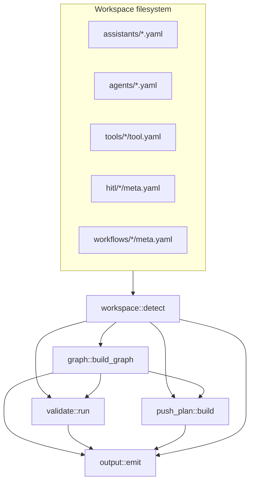

# Phase 1 (P0) — ResMate CLI agent-authoring improvements

**Status:** Draft for approval  
**Target repo:** [`resmed_resmate-cli`](.)  
**Reference workspace:** [`pr-agent-v2`](../pr-agent-v2) (Oracle PR use case)  
**Platform validator source:** [`resmedai-core-framework/lib/smriti_client`](../resmedai-core-framework/lib/smriti_client)

---

## 1. Goals & success criteria

### What P0 delivers

IDE agents (Cursor, Codex, etc.) can **inspect, validate, and plan pushes** for a ResMate use-case workspace **without parsing human-oriented CLI text**. All new commands support a global `--json` flag with stable exit codes and a machine-readable envelope.

| # | Capability | Command(s) |
|---|------------|------------|
| 1 | JSON output layer + exit codes | Global `--json` on all commands |
| 2 | Workspace detection + health | `resmate workspace info`, `resmate doctor` |
| 3 | Dependency link graph | `resmate graph` |
| 4 | Workspace-level validation | `resmate validate` |
| 5 | Local workflow schema validation (no API) | `resmate workflow validate <folder>` |
| 6 | Push plan without side effects | `resmate push-all --dry-run` |

### Success criteria (smoke test against `pr-agent-v2`)

Run from `pr-agent-v2` workspace root (with `.env` optional for connectivity checks):

```bash
# PR1 — envelope + exit codes
resmate --json config show | jq '.ok == true'
resmate --json config validate          # exit 0 if API reachable; exit 1 with JSON error if not

# PR2 — workspace
resmate --json workspace info | jq '.data.artifact_dirs.tools.count >= 3'
resmate --json doctor | jq '.data.checks | length >= 3'

# PR3 — graph
resmate --json graph | jq '.data.nodes | map(.kind) | unique'
# Expect: assistant, agent, tool, hitl, workflow
resmate --json graph | jq '[.data.edges[] | select(.kind=="broken_ref")] | length'
# Expect: 0 on a healthy pr-agent-v2 tree

# PR4 — workflow validate
resmate --json workflow validate oracle-purchase-requisition | jq '.ok == true'

# PR5 — full validate
resmate --json validate | jq '.data.summary.error_count == 0'

# PR6 — push plan
resmate --json push-all --dry-run | jq '.data.steps | map(.resource_type)'
# Expect order: hitl → workflow → tool → agent → assistant
```

**Agent ergonomics:** An agent can run `validate` + `graph` + `push-all --dry-run` in a loop, fix findings in YAML/handlers, and only call real `push` when `validate` reports zero errors.

---

## 2. Non-goals (defer to P1/P2)

| Item | Rationale |
|------|-----------|
| MCP server wrapping the CLI | P1 — depends on stable JSON contracts from P0 |
| `resmate scaffold` / codegen | P1 |
| `push-all` **execute** (batch push with rollback) | P1 — dry-run only in P0 |
| Fix `sync` to pull HITL (doc says it does; code does not) | P1 — tracked mismatch |
| Remote ID existence checks (API lookup per ref) | P2 — needs authenticated round-trips |
| Handler static analysis beyond secrets grep | P2 |
| `workflow push --validate-only` flag (use `workflow validate` instead) | Out of scope — separate subcommand |
| Replacing existing human `println!` paths for legacy commands in non-JSON mode | Keep current text output; JSON is additive |

---

## 3. Architecture overview

### Current state (baseline)

```
src/
├── main.rs          # clap dispatch; all command handlers inline (~800 LOC)
├── config.rs        # env + ~/.resmate/config.yaml
├── http_client.rs   # auth headers, config validate
├── auth.rs          # JWT
├── store.rs         # ~/.resmate/ids.yaml slug→id (legacy create/update only)
├── api/             # HTTP create/update/get per resource
└── specs/           # load/write YAML per artifact type
    ├── tool.rs, agent.rs, assistant.rs, hitl.rs, workflow.rs
    └── normalize.rs
```

- **No** global `--json`, structured errors, or consistent exit codes (`main` returns `Box<dyn Error>` → exit 1).
- **Workflow load** (`specs/workflow.rs::load_workflow_from_dir`) bundles files but does **not** validate schema/semantics.
- **`extract_workflow_slug`** lives in `main.rs` (lines 799–811); used by `sync` only.
- **Push order** is documented (hitl → workflow → tool → agent → assistant) but not enforced programmatically except in future `push-all`.

### Target module layout

```
src/
├── main.rs                 # thin: parse Cli, dispatch, map exit codes
├── cli/
│   └── mod.rs              # Cli, Commands, global --json
├── output.rs               # OutputMode, envelope, emit_success/emit_error, ExitCode mapping
├── workspace.rs            # Workspace, WorkspaceInfo, artifact dir resolution
├── doctor.rs               # composes workspace info + config + connectivity checks
├── graph.rs                # Graph, Node, Edge, build_graph()
├── push_plan.rs            # PushPlan, build_push_plan(dry_run)
├── commands/
│   ├── mod.rs
│   ├── workspace.rs        # workspace info handler
│   ├── doctor.rs
│   ├── graph.rs
│   ├── validate.rs
│   ├── push_all.rs
│   └── workflow.rs         # validate subcommand (extract from main workflow match)
├── validate/
│   ├── mod.rs              # run_workspace_validation(), Finding, Severity
│   ├── graph_rules.rs      # ID refs, slug matches, broken links
│   ├── artifact_rules.rs   # required fields, handler presence
│   ├── workflow_rules.rs   # hitlSlug → hitl folder, agentSlug → agent file
│   ├── secrets.rs          # grep handlers for likely secrets
│   └── push_readiness.rs   # missing id warnings vs errors
├── config.rs               # extend: resolved paths for all RESMATE_*_DIR
├── http_client.rs
├── auth.rs
├── store.rs
├── api/                    # unchanged API surface
└── specs/                  # add discovery helpers (see below)
```

### clap integration (`src/cli/mod.rs`)

```rust
#[derive(Parser)]
#[command(name = "resmate")]
pub struct Cli {
    /// Emit machine-readable JSON envelope on stdout; errors on stderr in human mode only
    #[arg(long, global = true)]
    pub json: bool,

    #[command(subcommand)]
    pub command: Commands,
}

#[derive(Subcommand)]
pub enum Commands {
    Workspace(WorkspaceCmd),
    Doctor,
    Graph(GraphCmd),
    Validate(ValidateCmd),
    PushAll(PushAllCmd),
    // existing: Tool, Agent, Assistant, Hitl, Config, Workflow, Sync
}
```

- Thread `CliContext { json: bool }` into handlers (or `output::OutputSink`).
- Refactor existing `match` arms in `main.rs` to call `commands::*` functions; migrate incrementally (PR1 can wrap without full refactor).

### New `specs` discovery helpers

Add to `specs/` (used by graph, validate, push_plan):

| Function | Module | Purpose |
|----------|--------|---------|
| `list_tool_dirs(base) -> Vec<PathBuf>` | `tool.rs` | Subdirs with `tool.yaml` |
| `list_agent_files(base) -> Vec<(String, PathBuf)>` | `agent.rs` | `*.yaml` stems |
| `list_assistant_files(base) -> Vec<(String, PathBuf)>` | `assistant.rs` | |
| `list_hitl_dirs(base) -> Vec<PathBuf>` | `hitl.rs` | Dirs with `meta.yaml` + `config.json` |
| `list_workflow_dirs(base) -> Vec<PathBuf>` | `workflow.rs` | Dirs passing `detect_format` |
| `parse_assistant_workflow_slug(system_context) -> Option<String>` | `assistant.rs` | Move from `main.rs` |
| `index_ids_by_resource() -> ResourceIndex` | `specs/mod.rs` | Map id/slug → path for all types |

### Data flow



---

## 4. PR breakdown

### PR1 — JSON output layer + exit codes

**Scope:** Foundation for all agent-facing commands. No new subcommands.

**Files**

| Action | Path |
|--------|------|
| Add | `src/output.rs` |
| Add | `src/cli/mod.rs` |
| Add | `docs/json-output.md` |
| Add | `docs/errors/README.md` + `docs/errors/*.md` (taxonomy) |
| Modify | `src/main.rs` — global `--json`, `main() -> ExitCode` |
| Modify | `src/config.rs` — `show_config_json()` |
| Modify | `src/http_client.rs` — `validate_connection_json()` |
| Add | `tests/output_envelope_test.rs` |

**`output.rs` API (proposed)**

```rust
pub enum OutputMode { Human, Json }

pub struct CliContext { pub mode: OutputMode, pub command: &'static str }

pub struct Envelope<T: Serialize> {
    pub ok: bool,
    pub command: String,
    pub data: Option<T>,
    pub error: Option<ErrorBody>,
    pub warnings: Vec<WarningBody>,
}

pub struct ErrorBody {
    pub code: String,       // stable machine code, e.g. "CONFIG_MISSING_API_KEY"
    pub message: String,
    pub details: Option<Value>,
}

pub fn emit_success<T: Serialize>(ctx: &CliContext, data: T);
pub fn emit_error(ctx: &CliContext, code: &str, message: impl Display, details: Option<Value>) -> ExitCode;
```

**Exit code contract**

| Code | Meaning | Examples |
|------|---------|----------|
| `0` | Success | validate with warnings only, dry-run plan |
| `1` | Runtime / user error | API failure, I/O error, connectivity |
| `2` | Usage / invalid input | bad flags, missing required arg |
| `3` | Validation failed | `validate` has ≥1 error finding; `workflow validate` schema/semantic fail |

- JSON mode: **always** print one envelope object on stdout (success or failure). Human mode: keep existing `println!` / `eprintln!` behavior for legacy commands.
- `config show` and `config validate` are the first consumers; other commands gain JSON envelopes as they ship in PR2–PR6.

**Acceptance criteria**

- [ ] `resmate --json config show` prints valid envelope with redacted secrets.
- [ ] `resmate --json config validate` returns exit `0` or `1` with `error.code` set.
- [ ] Missing subcommand returns exit `2`.
- [ ] `docs/json-output.md` documents envelope + exit codes.
- [ ] Unit test: serialize/deserialize envelope round-trip.

**Effort:** 2–3 person-days

---

### PR2 — `workspace info` / `doctor`

**Scope:** Workspace detection and environment diagnostics.

**Files**

| Action | Path |
|--------|------|
| Add | `src/workspace.rs` |
| Add | `src/doctor.rs` |
| Add | `src/commands/workspace.rs`, `src/commands/doctor.rs` |
| Modify | `src/cli/mod.rs`, `src/main.rs` |
| Modify | `src/config.rs` — expose `ResolvedPaths` |
| Add | `tests/workspace_detect_test.rs` |

**`workspace.rs` API**

```rust
pub struct Workspace {
    pub root: PathBuf,
    pub tools_dir: PathBuf,
    pub agents_dir: PathBuf,
    pub assistants_dir: PathBuf,
    pub hitl_dir: PathBuf,
    pub workflows_dir: PathBuf,
}

pub struct ArtifactCounts {
    pub tools: usize,
    pub agents: usize,
    pub assistants: usize,
    pub hitl: usize,
    pub workflows: usize,
}

pub struct WorkspaceInfo {
    pub root: PathBuf,
    pub detected: bool,           // true if ≥1 artifact dir exists with content
    pub artifact_dirs: HashMap<String, DirInfo>,
    pub counts: ArtifactCounts,
    pub env: EnvSummary,          // which RESMATE_* vars are set (not values)
    pub config: ConfigSummary,    // from config::load_config, redacted
}

impl Workspace {
    pub fn detect(start: &Path) -> Result<Self, WorkspaceError>;
    pub fn info(&self) -> Result<WorkspaceInfo, WorkspaceError>;
}
```

**`doctor` checks**

| Check id | What |
|----------|------|
| `workspace_root` | cwd exists, artifact dirs resolvable |
| `config_load` | `config::load_config()` succeeds |
| `api_key_set` | `RESMATE_API_KEY` or config file key present |
| `jwt_secret` | `RESMATE_SECRET` set (warn if missing — JWT auth may fail) |
| `connectivity` | optional `http_client::validate_connection()` (skip with `--offline`) |
| `artifact_dirs_exist` | each resolved dir exists (warn if missing) |

**CLI**

```
resmate workspace info [--json]
resmate doctor [--json] [--offline]
```

**Acceptance criteria**

- [ ] Against `pr-agent-v2`: reports 3+ tools, 1 agent, 1 assistant, 1+ hitl, 1 workflow.
- [ ] Honors `RESMATE_*_DIR` overrides.
- [ ] `doctor --offline` skips connectivity but still returns workspace + config checks.
- [ ] JSON envelope matches `docs/json-output.md`.

**Effort:** 2 person-days

---

### PR3 — `graph` command

**Scope:** Build and emit the assistant → agent → tool → hitl → workflow link graph with broken-ref detection.

**Files**

| Action | Path |
|--------|------|
| Add | `src/graph.rs`, `src/commands/graph.rs` |
| Modify | `src/specs/mod.rs` — `ResourceIndex`, discovery helpers |
| Move | `extract_workflow_slug` from `main.rs` → `specs/assistant.rs` |
| Add | `tests/graph_pr_agent_test.rs` |

**`graph.rs` API**

```rust
#[derive(Serialize)]
pub enum NodeKind { Assistant, Agent, Tool, Hitl, Workflow }

#[derive(Serialize)]
pub struct GraphNode {
    pub id: String,           // platform id or local slug if id empty
    pub slug: String,
    pub kind: NodeKind,
    pub path: String,         // relative to workspace root
    pub missing_id: bool,
}

#[derive(Serialize)]
pub enum EdgeKind {
    AssistantAgent,           // assistant.agents[] → agent.id
    AgentTool,                // agent.skills[] → tool.id
    AssistantWorkflow,        // systemContext workflow_definition_slug → workflow.meta.slug
    WorkflowHitl,             // stage.hitlSlug → hitl.meta.slug
    WorkflowAgent,            // stage.agentSlug → agent.slug (file stem or yaml slug)
    BrokenRef,                // any unresolved target
}

pub struct Graph {
    pub nodes: Vec<GraphNode>,
    pub edges: Vec<GraphEdge>,
    pub orphans: Vec<GraphNode>,   // nodes not reachable from any assistant
}

pub fn build_graph(ws: &Workspace) -> Result<Graph, GraphError>;
```

**Resolution rules**

1. **Assistants** — scan `assistants/*.yaml`; nodes keyed by `id` (or `slug` if id empty).
2. **Agents** — `agents` array entries matched against agent YAML `id` field (build id→path index).
3. **Tools** — `skills` array entries matched against `tools/*/tool.yaml` `id`.
4. **Workflow** — parse `workflow_definition_slug:` from `systemContext` (reuse `parse_assistant_workflow_slug`); match `workflows/<slug>/meta.yaml` `slug` field (folder name may differ — edge uses slug, not folder name).
5. **HITL** — for each workflow `flow.stages[].hitlSlug`, match `hitl/<folder>/meta.yaml` `slug`.
6. **Workflow agent** — `flow.stages[].agentSlug` matched to `agents/*.yaml` `slug` field.
7. **Broken refs** — any edge target not found → `EdgeKind::BrokenRef` + `validate` will surface as error.

**CLI**

```
resmate graph [--json] [--assistant <name>]   # optional filter to one assistant subtree
```

**Acceptance criteria**

- [ ] `pr-agent-v2`: single connected component from `oracle-pr-assistant`.
- [ ] Empty `id` in `workflows/oracle-purchase-requisition/meta.yaml` → node `missing_id: true`, not broken ref.
- [ ] Inject broken agent id in test fixture → graph shows `broken_ref` edge.
- [ ] Orphan tool (not in any agent `skills`) listed in `orphans`.

**Effort:** 3 person-days

---

### PR4 — `workflow validate`

**Scope:** Local workflow bundle validation without API push — schema + semantics identical to platform.

**Dependency strategy (decision required)**

| Option | Pros | Cons |
|--------|------|------|
| **A. Git dep `smriti_client` with `validate` feature** (recommended) | Single source of truth; stays in sync with platform | Requires monorepo PR; CLI needs git dep or published crate |
| **B. Path dep (monorepo dev only)** | Fast inner-loop | Breaks standalone `resmed_resmate-cli` CI |
| **C. Vendor `workflow_schema` + copy `validate.rs`** | No monorepo coupling | Drift risk; manual sync |

**Recommended: Option A**

1. Monorepo PR (can land before or in parallel):
   - Add to `lib/smriti_client/Cargo.toml`:
     ```toml
     [features]
     default = ["http"]
     validate = ["workflow_schema", "jsonschema", "serde_yaml"]
     http = ["reqwest", "async-trait", "tokio", ...]
     ```
   - `pub use workflow::loader::WorkflowDefinitionLoader` and `workflow::validate::{validate_json_schema, validate_semantics}` already public via loader.
2. CLI `Cargo.toml`:
   ```toml
   smriti_client = { git = "https://github.com/ResMed/resmedai-core-framework", package = "smriti_client", default-features = false, features = ["validate"] }
   ```
   (Adjust URL/branch to your org; pin rev for reproducibility.)

**Alternative if git dep blocked:** copy `workflow-definition.schema.json` into `resmed_resmate-cli/schemas/` and port `smriti_client/src/workflow/validate.rs` + minimal `AuthorBundle` types — document sync procedure in `docs/workflow-validator-sync.md`.

**Files**

| Action | Path |
|--------|------|
| Add | `src/commands/workflow.rs` — `validate` subcommand |
| Modify | `src/cli/mod.rs` — `WorkflowSubcommand::Validate` |
| Modify | `src/main.rs` — delegate workflow match |
| Modify | `Cargo.toml` — `smriti_client` or `jsonschema` + `workflow_schema` |
| Add | `tests/workflow_validate_test.rs` |
| Add | `testdata/workflows/` — minimal invalid fixtures (or use monorepo fixtures via git submodule) |

**Implementation**

```rust
// commands/workflow.rs
pub fn workflow_validate(ws: &Workspace, name: &str, ctx: &CliContext) -> ExitCode {
    let dir = ws.workflows_dir.join(name);
    match WorkflowDefinitionLoader::load_from_dir(&dir) {
        Ok(def) => emit_success(ctx, WorkflowValidateData {
            slug: def.slug,
            version: def.version,
            source_format: def.source_format.to_string(),
            path: dir.display().to_string(),
        }),
        Err(e) => emit_error(ctx, map_smriti_error(&e), ...),  // exit 3
    }
}
```

Map `SmritiError::SchemaValidation` → `WORKFLOW_SCHEMA_INVALID`; `SemanticValidation` → `WORKFLOW_SEMANTIC_INVALID`; `InvalidAuthorLayout` → `WORKFLOW_LAYOUT_INVALID`.

**Note:** CLI `specs/workflow.rs::load_workflow_from_dir` does not require `schema.yaml` for split layout detection alone; `smriti_client` loader **does** require `schema.yaml`. Align CLI push path in a follow-up (P1) — P0 validate uses smriti loader only.

**CLI**

```
resmate workflow validate <folder-name> [--json] [--workflows-dir PATH]
```

**Acceptance criteria**

- [ ] `pr-agent-v2` `oracle-purchase-requisition` passes.
- [ ] Missing `schema.yaml` → exit `3` with clear error path.
- [ ] Invalid `next` stage ref → semantic error with `flow.stages[...].next` path.
- [ ] No network calls.

**Effort:** 2–3 person-days (+ 1 day monorepo feature gate if needed)

---

### PR5 — `validate` command

**Scope:** Aggregate workspace validation: graph integrity + per-artifact lint + workflow validate + secrets scan + push readiness.

**Files**

| Action | Path |
|--------|------|
| Add | `src/validate/mod.rs` and rule modules |
| Add | `src/commands/validate.rs` |
| Modify | `src/cli/mod.rs`, `src/main.rs` |
| Add | `tests/validate_pr_agent_test.rs` |

**`validate/mod.rs` API**

```rust
#[derive(Serialize, Clone)]
pub enum Severity { Error, Warning, Info }

#[derive(Serialize, Clone)]
pub struct Finding {
    pub code: String,
    pub severity: Severity,
    pub message: String,
    pub path: Option<String>,
    pub resource: Option<ResourceRef>,
}

pub struct ValidationReport {
    pub findings: Vec<Finding>,
    pub summary: ValidationSummary,
}

pub fn run_workspace_validation(ws: &Workspace, opts: ValidateOptions) -> ValidationReport;
```

**CLI**

```
resmate validate [--json] [--strict] [--offline]
```

- `--strict`: warnings → exit `3`.
- Default: exit `3` only on errors.

**Acceptance criteria**

- [ ] Runs all P0 rules (section 6) against `pr-agent-v2` with zero errors.
- [ ] Findings include stable `code` strings documented in `docs/errors/`.
- [ ] Reuses `graph::build_graph` and `workflow validate` internally (no duplicate logic).

**Effort:** 3–4 person-days

---

### PR6 — `push-all --dry-run`

**Scope:** Emit ordered push plan as JSON; no API calls, no file writes.

**Files**

| Action | Path |
|--------|------|
| Add | `src/push_plan.rs`, `src/commands/push_all.rs` |
| Modify | `src/cli/mod.rs`, `src/main.rs` |
| Add | `tests/push_plan_test.rs` |

**`push_plan.rs` API**

```rust
#[derive(Serialize)]
pub enum PushAction { Create, Update, Skip }

#[derive(Serialize)]
pub struct PushStep {
    pub order: u32,
    pub resource_type: ResourceType,  // hitl | workflow | tool | agent | assistant
    pub name: String,                 // folder or file stem
    pub path: String,
    pub action: PushAction,
    pub has_id: bool,
    pub id: Option<String>,
    pub blockers: Vec<String>,        // validation finding codes that would block push
}

pub struct PushPlan {
    pub steps: Vec<PushStep>,
    pub skipped: Vec<PushStep>,
}

pub fn build_push_plan(ws: &Workspace, report: &ValidationReport) -> PushPlan;
```

**Ordering algorithm**

1. Collect all resources from workspace discovery.
2. Sort into phases: **hitl (all) → workflows (all) → tools (all) → agents (all) → assistants (all)**.
3. Within phase: alphabetical by name.
4. `Create` if `id` missing/empty in YAML/meta; `Update` if present.
5. Attach `blockers` from validation errors touching that resource.
6. Resources with blockers still appear in plan but flagged (agent can filter).

**CLI**

```
resmate push-all --dry-run [--json] [--assistant <name>]
```

`--assistant` limits plan to the subgraph for one assistant (uses graph).

**Acceptance criteria**

- [ ] `pr-agent-v2` plan lists `roc-select-requester-form` hitl before `oracle-purchase-requisition` workflow before tools/agents/assistant.
- [ ] No HTTP traffic (mock test with `reqwest` — no calls in dry-run).
- [ ] JSON plan matches schema in `docs/json-output.md#push-plan`.

**Effort:** 2 person-days

---

### PR sequencing

```
PR1 (json) ──┬──> PR2 (workspace) ──> PR3 (graph) ──> PR5 (validate) ──> PR6 (push-all dry-run)
             │
             └──> PR4 (workflow validate) ───────────────────────────────^
```

PR4 can parallel PR2–PR3 after PR1 merges.

---

## 5. JSON schemas / contracts

### Envelope (all commands)

Document in **`docs/json-output.md`** (created in PR1):

```json
{
  "ok": true,
  "command": "graph",
  "data": { },
  "error": null,
  "warnings": []
}
```

```json
{
  "ok": false,
  "command": "validate",
  "data": null,
  "error": {
    "code": "VALIDATION_FAILED",
    "message": "3 validation error(s)",
    "details": { "error_count": 3 }
  },
  "warnings": []
}
```

### Command-specific `data` payloads

| Command | `data` type | Notes |
|---------|-------------|-------|
| `workspace info` | `WorkspaceInfo` | §3 |
| `doctor` | `{ checks: CheckResult[] }` | each check: `id`, `status`, `message` |
| `graph` | `Graph` | nodes, edges, orphans |
| `validate` | `ValidationReport` | findings + summary |
| `workflow validate` | `{ slug, version, source_format, path }` | |
| `push-all --dry-run` | `PushPlan` | steps + skipped |
| `config show` | `ConfigSummary` | redacted |

### Error taxonomy

Directory: **`docs/errors/`**

| File | Codes |
|------|-------|
| `config.md` | `CONFIG_MISSING_API_KEY`, `CONFIG_LOAD_FAILED`, `CONNECTIVITY_FAILED` |
| `workspace.md` | `WORKSPACE_NOT_FOUND`, `ARTIFACT_DIR_MISSING` |
| `graph.md` | `GRAPH_BUILD_FAILED` |
| `validation.md` | `BROKEN_AGENT_REF`, `BROKEN_TOOL_REF`, `WORKFLOW_SLUG_MISMATCH`, `HITL_SLUG_UNRESOLVED`, `SECRET_SUSPECTED`, … |
| `workflow.md` | `WORKFLOW_SCHEMA_INVALID`, `WORKFLOW_SEMANTIC_INVALID`, `WORKFLOW_LAYOUT_INVALID` |

Agents should branch on `error.code`, not substring match on `message`.

---

## 6. Validation rules (P0 v1)

Explicit checks implemented in `src/validate/`:

### Graph / ID integrity

| Code | Severity | Rule |
|------|----------|------|
| `BROKEN_AGENT_REF` | Error | Every `assistants/*.yaml` `agents[]` value must match some `agents/*.yaml` `id` |
| `BROKEN_TOOL_REF` | Error | Every `agents/*.yaml` `skills[]` value must match some `tools/*/tool.yaml` `id` |
| `ORPHAN_AGENT` | Warning | Agent file not referenced by any assistant |
| `ORPHAN_TOOL` | Warning | Tool not in any agent `skills` |
| `DUPLICATE_ID` | Error | Same `id` appears in two files of the same resource type |

### Workflow binding

| Code | Severity | Rule |
|------|----------|------|
| `WORKFLOW_SLUG_MISSING` | Error | `systemContext` contains `workflow_type:` but no `workflow_definition_slug:` |
| `WORKFLOW_SLUG_MISMATCH` | Error | `workflow_definition_slug` does not match any `workflows/*/meta.yaml` `slug` |
| `WORKFLOW_FOLDER_ORPHAN` | Warning | Workflow dir exists but no assistant references its slug |
| `HITL_SLUG_UNRESOLVED` | Error | Workflow stage `hitlSlug` does not match any `hitl/*/meta.yaml` `slug` |
| `WORKFLOW_AGENT_UNRESOLVED` | Error | Stage `agentSlug` does not match any agent YAML `slug` |
| `WORKFLOW_VALIDATION` | Error | `WorkflowDefinitionLoader::load_from_dir` fails (delegates to PR4) |

### Field alignment (basics)

| Code | Severity | Rule |
|------|----------|------|
| `MISSING_REQUIRED_FIELD` | Error | Required YAML keys missing: tool `name`,`type`; agent `name`,`skills`; assistant `name`,`agents`; hitl meta `name`,`slug` |
| `MISSING_HANDLER` | Error | Tool dir missing handler file (`handler.js` / etc. per `specs/tool.rs`) |
| `MISSING_HITL_CONFIG` | Error | HITL dir missing `config.json` |
| `FAAS_MISSING_PACKAGE` | Error | Tool `type: FAAS` without `package.json` |
| `JS_UNEXPECTED_PACKAGE` | Warning | Tool `type: JS` with `package.json` present |

### Secrets grep (handlers)

| Code | Severity | Rule |
|------|----------|------|
| `SECRET_SUSPECTED` | Warning | Handler matches patterns: `AKIA[0-9A-Z]{16}`, `BEGIN (RSA |EC )?PRIVATE KEY`, `api_key\s*=\s*['\"][^'\"]+['\"]`, `password\s*=\s*['\"]`, `sk-[a-zA-Z0-9]{20,}` |

Scan: `tools/*/handler.js`, `tools/*/index.js`, etc.

### Push readiness

| Code | Severity | Rule |
|------|----------|------|
| `MISSING_ID` | Info | Resource has no `id` — will create on push |
| `MISSING_ID_BLOCKING` | Warning | Missing `id` on resource that other resources' ids depend on (e.g. tool without id referenced by agent with ids) |
| `PUSH_ORDER_VIOLATION` | Info | Only emitted in `push-all --dry-run` when plan detects assistant before its agent |

### Not in P0

- Remote check that ids exist on platform.
- JSON Schema validation for tool/agent/assistant YAML (only workflow gets full schema in P0).
- Handler `workflowPatch` shape lint.

---

## 7. Testing strategy

### Unit tests (in crate)

| Module | Test focus |
|--------|------------|
| `output.rs` | Envelope serialization, exit code mapping |
| `workspace.rs` | Dir resolution with env overrides |
| `graph.rs` | Synthetic mini-workspace in `testdata/` |
| `validate/*.rs` | One test per rule code |
| `push_plan.rs` | Ordering, create vs update |
| `specs/assistant.rs` | `parse_assistant_workflow_slug` |

### Integration tests

**Option A (recommended):** `tests/fixtures/pr-agent-v2/` — git submodule or CI checkout of sparse tree.

**Option B:** Embedded `testdata/pr-agent-minimal/` copied from pr-agent-v2 oracle PR subset:

```
testdata/pr-agent-minimal/
├── assistants/oracle-pr-assistant.yaml
├── agents/oracle-pr-agent.yaml
├── tools/roc-search-users/, roc-select-requester-hitlconfig/, roc-select-requester-save/
├── hitl/roc-select-requester-form/
└── workflows/oracle-purchase-requisition/
```

**CI jobs**

```bash
cargo test
cargo test --test graph_pr_agent_test
# Optional: point RESMATE_*_DIR at testdata
RESMATE_ASSISTANTS_DIR=testdata/.../assistants resmate --json validate
```

### Manual smoke (release checklist)

Run full smoke script from section 1 against live `pr-agent-v2` checkout.

---

## 8. Documentation updates

| When | Repo | File |
|------|------|------|
| PR1 | `resmed_resmate-cli` | `docs/json-output.md`, `docs/errors/*`, `README.md` (link) |
| PR2–PR6 | `resmed_resmate-cli` | `README.md` — new commands section |
| PR6 | `resmedai-core-framework` | `cli-context/cli/commands-reference.md` — add `workspace`, `doctor`, `graph`, `validate`, `push-all`, `workflow validate` |
| PR6 | `pr-agent-v2` (optional) | `cli/commands-reference.md` — sync from cli-context |

**`commands-reference.md` draft entries:**

```markdown
### `resmate workspace info`
### `resmate doctor [--offline]`
### `resmate graph [--assistant <name>]`
### `resmate validate [--strict]`
### `resmate workflow validate <folder>`
### `resmate push-all --dry-run`
```

Note global `--json` on all commands.

---

## 9. Risks & decisions

| Risk | Impact | Mitigation |
|------|--------|------------|
| **`smriti_client` dependency weight / edition 2024** | CLI on edition 2021; smriti on 2024 | Bump CLI edition to 2024; use `default-features = false, features = ["validate"]` to avoid tokio/http |
| **Validator drift** if vendored | False positives/negatives vs platform | Prefer git dep with pinned rev; CI job cross-checks against monorepo fixtures |
| **`sync` doc says HITL pulled; code does not** | Agents trust wrong mental model | Document in `doctor` info output; fix sync in P1 |
| **JS vs FAAS handler return shapes** | validate cannot lint `workflowPatch` without executing | P0 only checks file presence + secrets; document in validation.md |
| **`specs/workflow.rs` vs smriti loader split layout** | push may load workflow validate rejects | P0: validate uses smriti; add note in workflow validate errors; P1: align push loader |
| **Monolithic `main.rs` refactor** | Merge conflicts | PR1 adds `cli/` + `output` without moving all handlers; migrate per PR |
| **Empty workflow `id` in pr-agent-v2** | `missing_id` warnings, not errors | `MISSING_ID` severity Info for workflows |

### Decision log (to confirm at PR4 kickoff)

- [ ] **D1:** Git dependency on `smriti_client` with `validate` feature vs vendored schema  
- [ ] **D2:** `doctor` aliases `workspace doctor` or separate top-level command (plan: both — `doctor` is shortcut)  
- [ ] **D3:** Exit code `3` for validation vs reuse exit `1` (plan: `3` for agent branching)

---

## 10. Timeline estimate

| PR | Person-days | Depends on | Can parallelize |
|----|-------------|------------|-----------------|
| PR1 JSON layer | 2–3 | — | — |
| PR2 workspace/doctor | 2 | PR1 | — |
| PR3 graph | 3 | PR2 | — |
| PR4 workflow validate | 2–3 (+1 monorepo) | PR1 | With PR2–PR3 |
| PR5 validate | 3–4 | PR3, PR4 | — |
| PR6 push-all dry-run | 2 | PR5 | — |
| **Total sequential** | **~16–18 pd** | | |
| **With PR4 parallel** | **~14–16 pd** | | |

**Calendar (1 developer):** ~3–4 weeks  
**Calendar (2 developers):** ~2 weeks (Dev A: PR1→2→3→5→6; Dev B: PR4 + test fixtures + docs)

### Suggested implementation order

1. PR1 — merge quickly; unblocks everything  
2. PR2 + PR4 in parallel  
3. PR3  
4. PR5  
5. PR6  
6. Docs sync to cli-context  

---

## Appendix A — Current push/pull behavior (reference)

For implementers wiring `push_plan` and validation.

| Resource | Push entry | Create vs update | ID write-back |
|----------|------------|------------------|---------------|
| HITL | `specs::load_hitl_from_dir` → `api::create_hitl` / `update_hitl` | no `id` in meta → create | `write_hitl_id_to_meta` |
| Workflow | `specs::load_workflow_from_dir` → `api::create_workflow_definition` | always create (append version); conflict → bump version | `write_workflow_id` |
| Tool | `specs::load_tool_from_dir` → `api::create_tool` / `update_tool` | no `id` in yaml → create | `write_tool_id_to_yaml` |
| Agent | `specs::load_agent` → `api::create_agent` / `update_agent` | no `id` → create | `write_agent_id_to_yaml` |
| Assistant | `specs::load_assistant` → `api::create_assistant` / `update_assistant` | no `id` → create | `write_assistant_id_to_yaml` |

Pull requires existing `id` in local files (except sync upsert paths).

---

## Appendix B — `pr-agent-v2` fixture expectations

Oracle PR workspace anchor points for tests:

| Artifact | Path | Key refs |
|----------|------|----------|
| Assistant | `assistants/oracle-pr-assistant.yaml` | `agents: [6a425c83df630d3001fe2ad0]`, `workflow_definition_slug: oracle-purchase-requisition-v1` |
| Agent | `agents/oracle-pr-agent.yaml` | `skills: [6a425d94…, 6a425da5…, 6a425daa…]` |
| Tools | `tools/roc-search-users/`, `roc-select-requester-hitlconfig/`, `roc-select-requester-save/` | |
| HITL | `hitl/roc-select-requester-form/` | `slug: roc-select-requester-form` |
| Workflow | `workflows/oracle-purchase-requisition/` | `meta.slug: oracle-purchase-requisition-v1`, `flow.stages[0].hitlSlug: roc-select-requester-form`, `agentSlug: oracle-pr-agent` |

---

## Appendix C — Monorepo validator reuse map

| Monorepo symbol | Path | CLI usage |
|-----------------|------|-----------|
| `WorkflowDefinitionLoader::load_from_dir` | `lib/smriti_client/src/workflow/loader.rs` | `workflow validate` |
| `validate_json_schema` | `lib/smriti_client/src/workflow/validate.rs` | via loader |
| `validate_semantics` | same | via loader |
| `WORKFLOW_DEFINITION_SCHEMA` | `lib/workflow_schema/src/lib.rs` | via smriti |
| `push_workflow_definition --validate-only` | `lib/smriti_client/src/bin/push_workflow_definition.rs` | Reference behavior to match |

Interim monorepo binary flags: `--validate-only`, `--dry-run` — P0 CLI `workflow validate` should produce equivalent pass/fail for the same folder.
