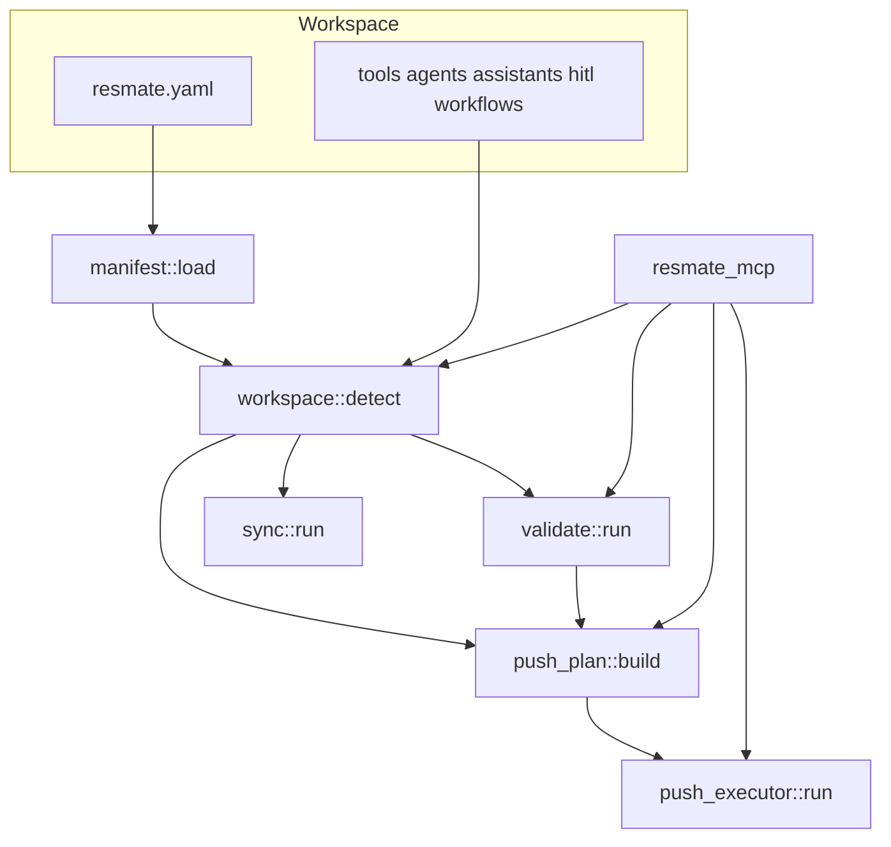

# Phase 2 (P1) — ResMate CLI agent-authoring improvements

**Status:** Draft for approval  
**Target repo:** [`resmed_resmate-cli`](../.)  
**Reference workspace:** [`pr-agent-v2`](../../pr-agent-v2) (Oracle PR use case)  
**Jira epic:** [CGA-1094](https://resmedglobal.atlassian.net/browse/CGA-1094)  
**Prerequisite:** [PHASE1-P0-COMPLETE.md](./PHASE1-P0-COMPLETE.md) (CGA-1095–CGA-1100)

---

## 1. Goals & success criteria

### What P1 delivers

IDE agents can **bootstrap workspaces, execute batch pushes, sync full artifact graphs, and integrate via MCP** — building on P0's inspect→validate→plan loop.

| # | Capability | Command(s) / artifact | Jira |
|---|------------|----------------------|------|
| 1 | Error code explanations for agents | `resmate explain <code>`, `resmate explain --list` | [CGA-1105](https://resmedglobal.atlassian.net/browse/CGA-1105) |
| 2 | Workspace bootstrap + manifest | `resmate init`, `resmate scaffold <recipe>`, `resmate.yaml` | [CGA-1102](https://resmedglobal.atlassian.net/browse/CGA-1102) |
| 3 | Batch push execution | `resmate push-all` (without `--dry-run`) | [CGA-1103](https://resmedglobal.atlassian.net/browse/CGA-1103) |
| 4 | Sync pulls HITL configs | `resmate sync` includes HITL | [CGA-1104](https://resmedglobal.atlassian.net/browse/CGA-1104) |
| 5 | MCP server for IDE integration | `resmate-mcp` (stdio) | [CGA-1101](https://resmedglobal.atlassian.net/browse/CGA-1101) |
| 6 | cli-context KB sync | commands-reference, checklist, skill | [CGA-1106](https://resmedglobal.atlassian.net/browse/CGA-1106) |

### Success criteria (smoke test against `pr-agent-v2`)

Run from `pr-agent-v2` workspace root with `resmate` on `PATH` and valid `.env` for API commands:

```bash
# PR7 — explain (CGA-1105)
resmate explain BROKEN_AGENT_REF | grep -qi remediation
resmate --json explain WORKFLOW_SCHEMA_INVALID | jq '.ok == true and .data.code != null'
resmate explain --list | grep -q BROKEN_TOOL_REF

# PR8 — sync HITL (CGA-1104) — requires assistant with id + remote HITL refs
# (destructive: run in temp copy or verify counts only)
resmate sync 2>&1 | grep -i hitl
resmate --json workspace info | jq '.data.counts.hitl >= 1'

# PR9 — init/scaffold (CGA-1102) — run in temp dir
tmpdir=$(mktemp -d) && cd "$tmpdir"
resmate init --json | jq '.ok == true'
test -d tools && test -d agents && test -f resmate.yaml
resmate scaffold oracle-pr --json | jq '.ok == true'
resmate --json workspace info | jq '.data.detected == true'

# PR10 — push-all execute (CGA-1103) — dry-run first, then execute with --yes in dev env
resmate --json push-all --dry-run | jq '.data.steps | map(.resource_type)'
# expect: hitl → workflow → tool → agent → assistant
resmate --json push-all --yes  # only against dev/staging with intentional changes

# PR11 — MCP (CGA-1101) — manual or integration test harness
# echo '{"jsonrpc":"2.0","id":1,"method":"tools/list"}' | resmate-mcp | jq '.result.tools | length >= 6'
# MCP tool `validate` against pr-agent-v2 → error_count == 0

# P0 regression (must still pass)
resmate --json validate | jq '.data.summary.error_count == 0'
resmate --json graph | jq '[.data.edges[] | select(.kind=="broken_ref")] | length'  # expect 0
```

**Agent ergonomics:** An agent can `init` → edit artifacts → `validate` → `push-all --dry-run` → `push-all --yes`, or call the same flow via MCP tools without shell parsing.

---

## 2. Non-goals (defer to P2 / Phase 3)

| Item | Rationale | Jira |
|------|-----------|------|
| Remote ID existence checks (`validate --remote`) | Needs authenticated round-trips per ref | CGA-1107 |
| Handler static analysis beyond secrets grep | AST/heuristics for `workflowPatch` | CGA-1112 |
| `resmate diff` local vs remote | Depends on GET APIs + drift model | CGA-1108 |
| Workflow push loader ↔ smriti validator alignment | Validate-pass / push-fail divergence | CGA-1109 |
| Full CLAD doc replacement | External stakeholder doc | CGA-1110 |
| CI integration test suite vs `pr-agent-v2` | Submodule/sparse checkout job | CGA-1111 |
| MCP HTTP/SSE transport | stdio first; HTTP later if needed | — |
| Automatic remote **delete** on push-all rollback | Platform may not support safe undo | — |
| JSON envelope on all legacy `push`/`pull`/`sync` subcommands | P1 focuses on new commands + MCP wrappers; migrate legacy incrementally | — |
| `validate --offline` remote semantics | Flag reserved in P0; still local-only in P1 | — |

---

## 3. Architecture overview

### P0 foundation (current state)

```
src/
├── main.rs                 # clap dispatch; legacy push/pull/sync + P0 command delegation
├── lib.rs                  # pub mod: config, graph, output, push_plan, specs, validate, workspace, workflow_validate
├── cli/mod.rs              # Cli, Commands, global --json
├── output.rs               # Envelope, emit_success/emit_error, CliExitCode
├── workspace.rs            # Workspace::detect, WorkspaceInfo
├── doctor.rs               # connectivity + config checks
├── graph.rs                # build_graph, build_graph_filtered
├── push_plan.rs            # build_push_plan (dry-run only today)
├── commands/
│   ├── workspace.rs, doctor.rs, graph.rs, validate.rs, push_all.rs, workflow.rs
├── validate/               # graph_rules, artifact_rules, workflow_rules, secrets, push_readiness
├── api/                    # create/update/get per resource
├── specs/                  # load/write YAML, discovery helpers, ResourceIndex
└── config.rs               # ResolvedPaths, RESMATE_*_DIR
```

P0 commands emit JSON via `output.rs`. `push-all` execute returns `NOT_IMPLEMENTED` in `commands/push_all.rs` (lines 13–21). `sync` in `main.rs` (lines 485–639) pulls assistant → workflow → agents → tools but **not HITL**.

### P1 target module layout

```
src/
├── manifest.rs             # NEW — resmate.yaml parse, merge with ResolvedPaths
├── errors_registry.rs      # NEW — codegen or parse docs/errors for explain
├── push_executor.rs        # NEW — execute_push_step, PushRunReport, rollback journal
├── sync.rs                 # NEW — extract sync logic from main.rs; add HITL branch
├── scaffold.rs             # NEW — init + recipe templates
├── commands/
│   ├── explain.rs          # NEW — CGA-1105
│   ├── init.rs             # NEW — CGA-1102
│   ├── scaffold.rs         # NEW — CGA-1102
│   └── push_all.rs         # MODIFY — wire execute path
├── bin/
│   └── resmate_mcp.rs      # NEW — MCP stdio server (CGA-1101)
├── workspace.rs            # MODIFY — manifest-aware detect + info
├── cli/mod.rs              # MODIFY — Explain, Init, Scaffold subcommands; push-all flags
└── main.rs                 # MODIFY — delegate sync to sync.rs; thinner match arms
```

### Data flow (P1 additions)



### Integration points

| P0 module | P1 consumer | Change |
|-----------|-------------|--------|
| `push_plan.rs` | `push_executor.rs` | Reuse `PushStep` ordering; add HTTP execution |
| `output.rs` | `explain`, `push-all execute`, MCP | Same envelope; MCP returns parsed `Envelope` JSON |
| `workspace.rs` | `manifest.rs`, `init`, MCP `workspace_root` param | Optional manifest overrides default dirs |
| `validate/mod.rs` | `push-all` preflight | Block execute unless `--force` when blockers present |
| `main.rs` push arms | `push_executor.rs` | Extract shared push_one helpers to avoid duplication |
| `graph.rs` | `sync.rs` HITL discovery | Reuse workflow→hitl slug resolution |

---

## 4. PR breakdown

### PR7 — `resmate explain` error codes

**Jira:** [CGA-1105](https://resmedglobal.atlassian.net/browse/CGA-1105) · **SP:** 3 · **Depends on:** P0 PR1 (CGA-1095)

**Scope:** Human and JSON explanations for stable error/finding codes. Foundation for MCP error remediation hints.

**Files**

| Action | Path |
|--------|------|
| Add | `src/errors_registry.rs` |
| Add | `src/commands/explain.rs` |
| Add | `docs/errors/validation.md`, `docs/errors/workflow.md`, `docs/errors/push.md` (split from README) |
| Modify | `docs/errors/README.md` — link to per-domain files + remediation column |
| Modify | `src/cli/mod.rs` — `Explain` subcommand |
| Modify | `src/main.rs` — dispatch |
| Modify | `src/lib.rs` — `pub mod errors_registry` |
| Add | `tests/explain_test.rs` |
| Add | `build.rs` (optional) — embed registry from markdown at compile time |

**`errors_registry.rs` API**

```rust
#[derive(Debug, Clone, Serialize)]
pub struct ErrorCodeDoc {
    pub code: String,
    pub domain: String,           // config | workspace | validation | workflow | push | usage
    pub severity: Option<String>, // error | warning | info (findings only)
    pub exit_code: Option<u8>,    // top-level envelope exit when applicable
    pub description: String,
    pub remediation: Vec<String>,
}

pub fn lookup(code: &str) -> Option<ErrorCodeDoc>;
pub fn list_all() -> Vec<ErrorCodeDoc>;
```

**CLI**

```
resmate explain <CODE> [--json]
resmate explain --list [--json] [--domain validation]
```

**Acceptance criteria**

- [ ] `resmate explain BROKEN_AGENT_REF` prints description + remediation hints.
- [ ] `resmate --json explain WORKFLOW_SCHEMA_INVALID` returns `ErrorCodeDoc` in `data`.
- [ ] All codes in `docs/errors/*.md` discoverable via `--list`.
- [ ] Unknown code → exit `2`, envelope `error.code = "UNKNOWN_ERROR_CODE"`.

**Effort:** 2 person-days

---

### PR8 — Fix `resmate sync` to pull HITL

**Jira:** [CGA-1104](https://resmedglobal.atlassian.net/browse/CGA-1104) · **SP:** 3 · **Depends on:** — (parallel with PR7)

**Scope:** Align `sync` behavior with cli-context docs. Extract sync from `main.rs` into testable module; add HITL pull after workflow sync.

**Doc vs code gap analysis**

| Source | Claims | Actual (`main.rs` 485–639) |
|--------|--------|----------------------------|
| `cli-context/cli/push-pull-sync.md` L76 | Sync pulls assistant → workflow → agents → tools | Matches except **no HITL** |
| `cli/mod.rs` L39 | "Sync all local assistants, their agents, and agents' tools" | Omits workflow + HITL explicitly |
| Workflow stages reference `hitlSlug` | HITL needed for local validate/graph | Synced workflow may reference HITL slugs with **no local `hitl/` folder** |
| `hitl pull` | Requires `id` in `meta.yaml` | Sync must **resolve slug → remote id** before pull |

**Implementation**

1. Add `src/sync.rs` with `pub async fn run_sync(opts: SyncOptions) -> SyncReport`.
2. After successful workflow write (`write_workflow_from_definition`), extract unique `hitlSlug` values from workflow `flow.stages` in API response (or parsed local `flow.yaml`).
3. For each slug, resolve remote HITL id:
   - **Preferred:** add `api::find_hitl_by_slug(slug)` via platform search/list endpoint if available.
   - **Fallback:** if workflow stage embeds `hitlConfigId` / `hitlId`, use `api::get_record("hitlConfig", id)`.
4. Upsert local folder via `specs::write_hitl_from_record` (same as `hitl pull`).
5. Add `hitl_count` to sync summary; support `--json` envelope with `SyncReport`.
6. Update `SyncCmd` in `cli/mod.rs`: add `--hitl-dir`, `--json` (global already applies).

**Files**

| Action | Path |
|--------|------|
| Add | `src/sync.rs` |
| Add | `src/api/hitl.rs` — `find_hitl_by_slug` or `list_hitl_configs` (if API supports) |
| Modify | `src/main.rs` — delegate `Commands::Sync` to `sync::run` |
| Modify | `src/cli/mod.rs` — sync doc comment + `--hitl-dir` |
| Add | `tests/sync_hitl_test.rs` — mock HTTP or fixture JSON |
| Modify | `resmedai-core-framework/cli-context/cli/push-pull-sync.md` — document HITL in sync order |

**Sync order (updated)**

```
assistant → workflow → hitl (from workflow stages) → agents → tools
```

**Acceptance criteria**

- [ ] `resmate sync` pulls HITL when workflow stages reference `hitlSlug`.
- [ ] Summary includes hitl count: `N assistant(s), …, N hitl(s), …`.
- [ ] `pr-agent-v2` after sync: `workspace info` hitl count ≥ 1.
- [ ] cli-context `push-pull-sync.md` matches behavior.

**Effort:** 2–3 person-days

---

### PR9 — `resmate init` / `scaffold` + `resmate.yaml` manifest

**Jira:** [CGA-1102](https://resmedglobal.atlassian.net/browse/CGA-1102) · **SP:** 5 · **Depends on:** P0 PR1 (CGA-1095)

**Scope:** Bootstrap empty workspaces and recipe-based starters. Optional manifest for path defaults.

**Files**

| Action | Path |
|--------|------|
| Add | `src/manifest.rs` |
| Add | `src/scaffold.rs` — template copy / render |
| Add | `src/commands/init.rs`, `src/commands/scaffold.rs` |
| Add | `templates/init/` — `.gitignore`, `resmate.yaml`, empty dir placeholders |
| Add | `templates/recipes/oracle-pr/` — from `cli-context/examples/oracle-purchase-requisition/` subset |
| Add | `docs/resmate-yaml.md` — manifest spec |
| Modify | `src/workspace.rs` — `find_workspace_root` checks `resmate.yaml`; `ResolvedPaths` reads manifest |
| Modify | `src/config.rs` — manifest paths override defaults before env vars (env still wins) |
| Modify | `src/cli/mod.rs`, `src/main.rs` |
| Add | `tests/init_scaffold_test.rs` |

**CLI**

```
resmate init [--name <project>] [--json] [--force]   # refuse if artifacts exist unless --force
resmate scaffold <recipe> [--name <slug>] [--json]   # recipes: oracle-pr, minimal, form-wizard
```

**Acceptance criteria**

- [ ] `resmate init` creates `tools/`, `agents/`, `assistants/`, `hitl/`, `workflows/`, `resmate.yaml`.
- [ ] `resmate scaffold oracle-pr` produces layout compatible with `validate` (may have intentional placeholder IDs for user to fill).
- [ ] `workspace info` reports `manifest: { present: true, name: "..." }` when `resmate.yaml` exists.
- [ ] Env `RESMATE_*_DIR` still overrides manifest paths.

**Effort:** 3–4 person-days

---

### PR10 — `push-all` execute (batch push with rollback journal)

**Jira:** [CGA-1103](https://resmedglobal.atlassian.net/browse/CGA-1103) · **SP:** 8 · **Depends on:** P0 PR6 (CGA-1100), PR7 recommended

**Scope:** Execute ordered push plan with confirmation gate, per-step progress JSON, failure stop, and rollback **journal** (not remote delete).

**Files**

| Action | Path |
|--------|------|
| Add | `src/push_executor.rs` |
| Modify | `src/commands/push_all.rs` — remove `NOT_IMPLEMENTED`; call executor |
| Modify | `src/cli/mod.rs` — `--yes`, `--force`, `--stop-on-error` (default true) |
| Modify | `src/main.rs` — optionally thin push arms to shared helpers in `push_executor` |
| Add | `docs/errors/push.md` — `PUSH_STEP_FAILED`, `PUSH_BLOCKED`, `PUSH_PARTIAL` |
| Modify | `docs/json-output.md` — `PushRunReport` schema |
| Add | `tests/push_executor_test.rs` — mock API layer |

**`push_executor.rs` API**

```rust
#[derive(Serialize)]
pub struct StepResult {
    pub order: u32,
    pub resource_type: ResourceType,
    pub name: String,
    pub action: PushAction,
    pub status: StepStatus,       // success | failed | skipped
    pub id: Option<String>,
    pub error: Option<ErrorBody>,
}

#[derive(Serialize)]
pub struct PushRunReport {
    pub dry_run: bool,
    pub steps: Vec<StepResult>,
    pub completed_count: u32,
    pub failed_at: Option<u32>,
    pub rollback_journal: Vec<RollbackEntry>,  // local file snapshots / created ids
}

pub async fn execute_push_plan(
    ws: &Workspace,
    plan: &PushPlan,
    opts: PushExecuteOptions,
    ctx: &CliContext,
) -> Result<PushRunReport, PushExecutorError>;
```

**Acceptance criteria**

- [ ] `resmate push-all --dry-run` unchanged (no HTTP).
- [ ] `resmate push-all --yes` executes hitl → workflow → tool → agent → assistant.
- [ ] Steps with validation `blockers` skipped unless `--force` (emit warning).
- [ ] Failed step stops run; JSON report includes `failed_at` and `rollback_journal`.
- [ ] ID write-back matches Appendix A (P0 plan) — reuse `specs::write_*_id_*`.

**Effort:** 4–5 person-days

---

### PR11 — MCP server wrapping ResMate CLI

**Jira:** [CGA-1101](https://resmedglobal.atlassian.net/browse/CGA-1101) · **SP:** 8 · **Depends on:** P0 complete, PR7 (explain), PR10 (push-all execute for mutating tool)

**Scope:** stdio MCP server exposing inspect/validate/plan/push tools for Cursor and other IDE agents.

**Files**

| Action | Path |
|--------|------|
| Add | `src/bin/resmate_mcp.rs` |
| Add | `src/mcp/mod.rs`, `src/mcp/tools.rs`, `src/mcp/handler.rs` |
| Modify | `Cargo.toml` — `[[bin]] name = "resmate-mcp"`; dep `rmcp` or `mcp-sdk` (evaluate crate maturity) |
| Add | `docs/mcp-setup.md` |
| Modify | `README.md` — Cursor `mcp.json` example |
| Add | `tests/mcp_tools_test.rs` |

**Acceptance criteria**

- [ ] `resmate-mcp` starts on stdio; `tools/list` returns ≥ 8 tools.
- [ ] Each tool returns **parsed** JSON envelope in `content[].text` (not raw unparseable stdout).
- [ ] Mutating tool `push_all_execute` requires `confirm: true` parameter.
- [ ] Smoke: MCP `validate` against `pr-agent-v2` → zero errors.

**Effort:** 4–5 person-days

---

### PR12 — cli-context Phase 1–2 documentation sync

**Jira:** [CGA-1106](https://resmedglobal.atlassian.net/browse/CGA-1106) · **SP:** 2 · **Depends on:** PR7–PR11 as they merge

**Scope:** Keep agent KB aligned with shipped commands.

**Files (repo: `resmedai-core-framework`)**

| Action | Path |
|--------|------|
| Modify | `cli-context/cli/commands-reference.md` |
| Modify | `cli-context/cli/authoring-checklist.md` |
| Modify | `cli-context/cli/push-pull-sync.md` |
| Modify | `cli-context/.cursor/skills/resmate-use-case/SKILL.md` |
| Modify | `cli-context/AGENTS.md` — P1 pre-push loop if needed |
| Optional | `pr-agent-v2` copied docs sync |

**Acceptance criteria**

- [ ] All P1 commands documented with `--json` examples.
- [ ] MCP setup section links to `resmed_resmate-cli/docs/mcp-setup.md`.
- [ ] `resmate.yaml` documented in `cli/setup.md` or new manifest section.

**Effort:** 1–2 person-days (incremental across PR7–PR11)

---

### PR sequencing

```
                    ┌──> PR8 (sync HITL) ──────────────┐
PR7 (explain) ──────┤                                  ├──> PR12 (cli-context)
                    ├──> PR9 (init/scaffold) ──────────┤
P0 PR6 ────────────> PR10 (push-all execute) ───────> PR11 (MCP)
```

**Recommended merge order**

1. **PR7** — explain (unblocks MCP error UX)
2. **PR8** — sync HITL (parallel, no P1 deps)
3. **PR9** — init/scaffold (parallel)
4. **PR10** — push-all execute (needs P0 `push_plan`)
5. **PR11** — MCP (needs PR7 + PR10 for full surface)
6. **PR12** — cli-context (last; can land partial doc PRs after each feature)

---

## 5. JSON / MCP contracts

### Envelope (unchanged from P0)

All new commands use `src/output.rs` envelope. See [json-output.md](./json-output.md).

### New `data` payloads

| Command | `data` type | Notes |
|---------|-------------|-------|
| `explain <code>` | `ErrorCodeDoc` | § PR7 |
| `explain --list` | `{ codes: ErrorCodeDoc[] }` | filterable by domain |
| `init` | `{ root, created_dirs, manifest_path }` | |
| `scaffold <recipe>` | `{ root, recipe, files_written: string[] }` | |
| `push-all` (execute) | `PushRunReport` | includes `rollback_journal` |
| `sync` | `SyncReport` | `{ assistants, agents, workflows, hitl, tools, warnings[] }` |

### MCP tool → CLI mapping

| MCP tool name | Maps to | Mutating | `confirm` required |
|---------------|---------|----------|-------------------|
| `workspace_info` | `workspace info --json` | No | — |
| `doctor` | `doctor --json` | No | — |
| `graph` | `graph --json` | No | — |
| `validate` | `validate --json` | No | — |
| `workflow_validate` | `workflow validate <name> --json` | No | — |
| `push_all_dry_run` | `push-all --dry-run --json` | No | — |
| `push_all_execute` | `push-all --yes --json` | **Yes** | **Yes** |
| `explain` | `explain <code> --json` | No | — |
| `explain_list` | `explain --list --json` | No | — |
| `init_workspace` | `init --json` | **Yes** | **Yes** |
| `scaffold_recipe` | `scaffold <recipe> --json` | **Yes** | **Yes** |

**MCP tool result shape**

```json
{
  "content": [
    {
      "type": "text",
      "text": "{ \"ok\": true, \"command\": \"validate\", \"data\": { ... } }"
    }
  ],
  "isError": false
}
```

On CLI failure, set `isError: true` and include full envelope with `ok: false`.

**Common tool input schema fields**

```json
{
  "workspace_root": { "type": "string", "description": "Path to use-case workspace; default cwd" },
  "assistant": { "type": "string", "description": "Filter graph/push-all to one assistant" }
}
```

---

## 6. `resmate.yaml` manifest spec

Optional file at workspace root. **Env vars (`RESMATE_*_DIR`) override manifest values.**

```yaml
# resmate.yaml — schema version 1
version: 1
name: oracle-pr-agent-v2
description: Oracle purchase requisition use case

# Artifact directory paths (relative to workspace root or absolute)
dirs:
  tools: tools
  agents: agents
  assistants: assistants
  hitl: hitl
  workflows: workflows

# Default assistant for graph / push-all when --assistant omitted (optional)
default_assistant: oracle-pr-assistant

# Scaffold recipe metadata (optional)
recipe: oracle-pr

# Platform hints (optional, not secrets)
platform:
  base_url: https://api-dev.ai.resmed.com
```

| Field | Required | Purpose |
|-------|----------|---------|
| `version` | Yes | Manifest schema version (`1`) |
| `name` | Yes | Project slug for display / MCP |
| `dirs.*` | No | Defaults to standard layout names |
| `default_assistant` | No | Convenience for `graph` / `push-all` |
| `recipe` | No | Records which scaffold was used |
| `platform.base_url` | No | Documentation only; auth still via env |

**Discovery rule:** `find_workspace_root` treats presence of `resmate.yaml` **or** any artifact dir as workspace (see `workspace.rs::is_workspace_root`).

**Implementation:** `manifest::load(root) -> Option<Manifest>`; `ResolvedPaths::resolve_with_manifest(root, manifest)`.

Full spec: `docs/resmate-yaml.md` (PR9).

---

## 7. `push-all` execute semantics

### Dry-run vs execute

| Mode | Flag | HTTP | File writes | Exit code |
|------|------|------|-------------|-----------|
| Plan only | `--dry-run` | None | None | `0` |
| Execute | (default when `--dry-run` absent) | Per step | ID write-back on create | `0` all success; `1` step failure; `3` if preflight validate fails |

### Preflight

1. `Workspace::detect`
2. `run_workspace_validation` (offline filesystem rules)
3. `build_push_plan`
4. If any step has `blockers` and not `--force` → exit `3`, envelope `PUSH_BLOCKED` with blocker list
5. Unless `--yes` → interactive confirm (human mode); JSON mode requires `--yes` (else `USAGE_CONFIRM_REQUIRED`)

### Execution order

Same as P0 dry-run: **hitl → workflow → tool → agent → assistant** (see `push_plan.rs::phase_order`).

Within phase: alphabetical by resource name.

### Per-step behavior

Reuse logic from `main.rs` push arms:

| Type | Loader | API | ID write-back |
|------|--------|-----|---------------|
| HITL | `specs::load_hitl_from_dir` | `api::create_hitl` / `update_hitl` | `write_hitl_id_to_meta` |
| Workflow | `specs::load_workflow_from_dir` | `api::create_workflow_definition` | `write_workflow_id` |
| Tool | `specs::load_tool_from_dir` | `api::create_tool` / `update_tool` | `write_tool_id_to_yaml` |
| Agent | `specs::load_agent` | `api::create_agent` / `update_agent` | `write_agent_id_to_yaml` |
| Assistant | `specs::load_assistant` | `api::create_assistant` / `update_assistant` | `write_assistant_id_to_yaml` |

Emit progressive JSON in human mode as plain logs; in JSON mode emit **one final** `PushRunReport` (streaming NDJSON is P2 optional).

### Rollback strategy

**No automatic remote deletion** in P1.

| Failure point | Behavior |
|---------------|----------|
| Step N fails | Stop execution (`--stop-on-error` default true) |
| Prior steps | Already committed on platform |
| Local state | IDs written back for successful creates — **do not revert** (would desync) |
| `rollback_journal` | Records `{ step, action, id, local_path, snapshot_hash? }` for operator manual recovery |
| Operator guidance | Doc: re-run `push-all --dry-run`; use platform UI to delete orphan creates if needed |

`--force` risks: may push resources with validation blockers; document in `docs/errors/push.md`.

---

## 8. MCP server design

### Repo layout

```
resmed_resmate-cli/
├── src/
│   ├── bin/resmate_mcp.rs      # entry: stdio transport loop
│   └── mcp/
│       ├── mod.rs
│       ├── tools.rs            # tool descriptors + JSON schemas
│       └── handler.rs          # dispatch → library fns (not shell spawn)
├── docs/mcp-setup.md
└── Cargo.toml                  # [[bin]] resmate-mcp
```

**Design choice:** Call `resmate` library functions (`commands::*`, `workspace::detect`) **in-process** — not `std::process::Command("resmate")` — for lower latency and shared config.

### Transport

- **P1:** stdio only (`stdin`/`stdout` JSON-RPC).
- Cursor config example in `docs/mcp-setup.md`:

```json
{
  "mcpServers": {
    "resmate": {
      "command": "/path/to/resmate-mcp",
      "args": [],
      "env": {
        "RESMATE_API_KEY": "${env:RESMATE_API_KEY}"
      }
    }
  }
}
```

### Safety

| Risk | Mitigation |
|------|------------|
| Accidental batch push | `push_all_execute` requires `confirm: true` |
| Init over existing workspace | `init_workspace` requires `confirm: true`; refuse without `--force` equivalent |
| API key exposure | MCP inherits env; never return secrets in tool results |
| Path traversal | Resolve `workspace_root` to absolute; must contain artifact dirs or `resmate.yaml` |

### Dependency

Evaluate Rust MCP crates at PR11 kickoff:

- `rmcp` (official Rust SDK direction)
- Fallback: minimal JSON-RPC stdio loop without full SDK if crate API unstable

---

## 9. Sync HITL fix — detailed gap analysis

### Current `sync` flow (`main.rs`)

```
for each assistants/*.yaml with id:
  pull assistant (get_record "chat")
  if systemContext has workflow_definition_slug:
    pull workflow (get_workflow_definition)
  for each agent id in assistant.agents:
    pull agent → upsert_agent_from_api_data
    for each skill in agent.skills:
      pull tool → upsert_tool_from_api_data
```

**Missing:** No iteration over HITL slugs from workflow stages; no `hitl_dir` in `SyncCmd`.

### Expected flow (after PR8)

```
... pull workflow ...
collect hitlSlugs from flow.stages[].hitlSlug (unique)
for each hitlSlug:
  resolve remote id (find_hitl_by_slug or embedded id)
  pull → write_hitl_from_record into hitl/<folder>/
... continue agents/tools ...
```

### HITL folder naming

- Prefer existing local folder matching `meta.slug` if present.
- Else create folder named after slug (sanitize `/` etc.).
- Match `graph.rs` HITL resolution: `hitl/<folder>/meta.yaml` `slug` field.

### JSON mode

`sync` currently human-only `println!`. PR8 adds JSON envelope:

```json
{
  "ok": true,
  "command": "sync",
  "data": {
    "assistants": 1,
    "workflows": 1,
    "hitl": 1,
    "agents": 1,
    "tools": 3,
    "warnings": []
  }
}
```

---

## 10. Testing strategy

### Unit tests

| Module | Focus |
|--------|-------|
| `errors_registry.rs` | All codes parse; lookup case-insensitive |
| `manifest.rs` | Path resolution precedence: env > manifest > default |
| `scaffold.rs` | Template copy idempotency with `--force` |
| `push_executor.rs` | Mock API: order, stop-on-error, journal entries |
| `sync.rs` | Extract hitlSlugs from fixture workflow JSON |
| `mcp/tools.rs` | Schema validation, confirm gate |

### Integration tests

| Test file | Fixture |
|-----------|---------|
| `tests/explain_test.rs` | All README codes resolvable |
| `tests/init_scaffold_test.rs` | Temp dir init + scaffold oracle-pr |
| `tests/push_executor_test.rs` | `testdata/` mini workspace + wiremock HTTP |
| `tests/sync_hitl_test.rs` | Workflow JSON with `hitlSlug` → mock HITL record |
| `tests/mcp_tools_test.rs` | In-process MCP handler calls |

### Manual smoke (release checklist)

1. P0 regression script from [PHASE1-P0-COMPLETE.md](./PHASE1-P0-COMPLETE.md)
2. P1 script from §1 above
3. Cursor: add `resmate-mcp`, run validate tool on `pr-agent-v2`

### Test data

- Reuse `testdata/workflows/` from P0
- Add `testdata/sync/workflow-with-hitl.json` for PR8
- Add `templates/recipes/oracle-pr/` aligned with `pr-agent-v2` oracle subset

---

## 11. Documentation updates

| When | Repo | File |
|------|------|------|
| PR7 | `resmed_resmate-cli` | `docs/errors/*.md`, `docs/json-output.md` |
| PR8 | both | `cli-context/cli/push-pull-sync.md` |
| PR9 | `resmed_resmate-cli` | `docs/resmate-yaml.md`, `README.md` |
| PR10 | `resmed_resmate-cli` | `docs/json-output.md#push-run`, `docs/errors/push.md` |
| PR11 | `resmed_resmate-cli` | `docs/mcp-setup.md`, `README.md` |
| PR12 | `resmedai-core-framework` | `cli-context/cli/commands-reference.md`, `authoring-checklist.md`, skill |

**`commands-reference.md` draft entries (P1)**

```markdown
### `resmate explain <code> [--list]`
### `resmate init [--name]`
### `resmate scaffold <recipe>`
### `resmate push-all [--yes] [--force]`  # execute
### `resmate sync`  # includes HITL
### MCP: see resmed_resmate-cli/docs/mcp-setup.md
```

---

## 12. Risks & decisions

| Risk | Impact | Mitigation |
|------|--------|------------|
| **HITL slug → id API gap** | Sync cannot pull HITL without list/search endpoint | Spike in PR8; fallback to embedded ids in workflow API response |
| **Push-all partial failure** | Orphan remote resources | Rollback journal + docs; no auto-delete |
| **`main.rs` push duplication** | Drift between single push and batch | Extract `push_executor::push_resource` shared by PR10 |
| **MCP crate instability** | Blocked PR11 | Thin JSON-RPC stdio layer as fallback |
| **Scaffold drift from examples** | Generated workspace fails validate | Pin templates to `cli-context/examples/`; CI test scaffold output |
| **Manifest vs env precedence confusion** | Wrong dirs used | Document: env > manifest > default; show resolved paths in `workspace info` |
| **Workflow push version bump** | Batch push fails mid-run on conflict | Reuse single-push retry logic from `main.rs` workflow arm |
| **Legacy commands lack JSON** | MCP cannot wrap all push types in P1 | MCP exposes `push_all_execute` only for batch; per-resource push stays CLI |

### Decision log (confirm at kickoff)

- [ ] **D1:** MCP in-process library calls vs subprocess `resmate --json` (plan: **in-process**)
- [ ] **D2:** `resmate.yaml` `version: 1` schema frozen in PR9
- [ ] **D3:** Rollback = journal only, no remote delete (plan: **yes**)
- [ ] **D4:** MCP mutating tools require `confirm: true` (plan: **yes**)
- [ ] **D5:** Split `docs/errors/` into domain files in PR7 (plan: **yes**)

---

## 13. Timeline estimate

| PR | Story | Person-days | Depends on | Parallelizable |
|----|-------|-------------|------------|----------------|
| PR7 explain | CGA-1105 | 2 | P0 PR1 | With PR8, PR9 |
| PR8 sync HITL | CGA-1104 | 2–3 | — | With PR7, PR9 |
| PR9 init/scaffold | CGA-1102 | 3–4 | P0 PR1 | With PR7, PR8 |
| PR10 push-all execute | CGA-1103 | 4–5 | P0 PR6 | After PR7 recommended |
| PR11 MCP | CGA-1101 | 4–5 | PR7, PR10 | — |
| PR12 cli-context | CGA-1106 | 1–2 | PR7–11 | Incremental |
| **Total sequential** | | **~18–21 pd** | | |
| **With PR7/8/9 parallel** | | **~14–17 pd** | | |

**Story points:** 29 SP (per Jira CGA-1101–1106)

**Calendar (1 developer):** ~3–4 weeks after P0 merge  
**Calendar (2 developers):** ~2–3 weeks (Dev A: PR7→PR10→PR11; Dev B: PR8→PR9→PR12 docs)

---

## 14. Dependency on P0 — explicit prerequisites

| P0 deliverable | Jira | Required for P1 |
|----------------|------|-----------------|
| JSON envelope + exit codes | CGA-1095 | All P1 commands + MCP |
| `workspace::detect`, `ResolvedPaths` | CGA-1096 | init, manifest, MCP `workspace_root` |
| `graph::build_graph_filtered` | CGA-1097 | push-all subgraph filter; sync HITL discovery |
| `workflow validate` | CGA-1098 | scaffold oracle-pr sanity |
| `validate` + stable finding codes | CGA-1099 | push-all blockers; explain registry |
| `push_plan::build_push_plan` | CGA-1100 | push-all execute ordering |
| `docs/json-output.md` | CGA-1095 | MCP contracts |
| `docs/errors/README.md` | CGA-1095 | explain command source |

**Gate:** Do not start PR10 until `resmate --json push-all --dry-run` passes smoke on `pr-agent-v2` (see [PHASE1-P0-COMPLETE.md](./PHASE1-P0-COMPLETE.md)).

---

## Appendix A — Push executor pseudocode

```rust
async fn execute_push_plan(...) -> PushRunReport {
    let mut results = vec![];
    let mut journal = vec![];

    for step in &plan.steps {
        if !step.blockers.is_empty() && !opts.force {
            // should have been caught in preflight
            continue;
        }
        match push_one(ws, step).await {
            Ok(id) => {
                journal.push(RollbackEntry::created(step, &id));
                results.push(StepResult::success(step, id));
            }
            Err(e) => {
                results.push(StepResult::failed(step, e));
                break;
            }
        }
    }
    PushRunReport { steps: results, rollback_journal: journal, .. }
}
```

---

## Appendix B — `pr-agent-v2` fixture expectations (unchanged from P0)

| Artifact | Path | P1 notes |
|----------|------|----------|
| Assistant | `assistants/oracle-pr-assistant.yaml` | sync + push-all terminal step |
| Agent | `agents/oracle-pr-agent.yaml` | |
| Tools | `tools/roc-search-users/`, etc. | |
| HITL | `hitl/roc-select-requester-form/` | **sync must populate** |
| Workflow | `workflows/oracle-purchase-requisition/` | hitlSlug → roc-select-requester-form |

---

## Appendix C — Jira traceability

| Key | PR | Title |
|-----|-----|-------|
| [CGA-1105](https://resmedglobal.atlassian.net/browse/CGA-1105) | PR7 | resmate explain error codes |
| [CGA-1104](https://resmedglobal.atlassian.net/browse/CGA-1104) | PR8 | Fix resmate sync to pull HITL |
| [CGA-1102](https://resmedglobal.atlassian.net/browse/CGA-1102) | PR9 | resmate init/scaffold + resmate.yaml |
| [CGA-1103](https://resmedglobal.atlassian.net/browse/CGA-1103) | PR10 | push-all execute |
| [CGA-1101](https://resmedglobal.atlassian.net/browse/CGA-1101) | PR11 | MCP server wrapping CLI |
| [CGA-1106](https://resmedglobal.atlassian.net/browse/CGA-1106) | PR12 | Update cli-context Phase 1–2 |

**Phase 2 total:** 29 SP · 6 PRs · ~14–21 person-days
