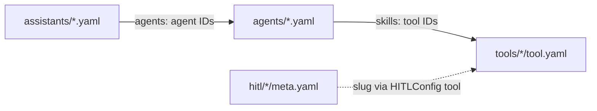

# ResMate CLI Command Reference

This document provides a complete, high-fidelity reference for the `resmate` CLI (`resmed_resmate-cli`). Running commands from the **workspace root** (the folder containing `resmate.yaml` bootstrapped with `resmate init`) ensures proper path resolution for tools, agents, assistants, HITL, and workflows.

---

## 1. CLI Setup, Prerequisites & Environment

### Where to Run Commands
You should run `resmate` commands from your **workspace root**. A standardized workspace directory layout looks like this:

```text
my-workspace/                 ← resmate init output
├── .env                      ← Local secrets (ignored by Git)
├── resmate.yaml              ← Workspace manifest and env mapping
├── tools/
│   └── my-tool/              ← Live tool folder
│       ├── tool.yaml
│       ├── handler.js
│       └── payload.json      ← Testing payload
├── agents/
│   └── my-agent.yaml         ← Live agent definitions
├── assistants/
│   └── my-assistant.yaml     ← Live assistant definitions
├── workflows/                ← Optional: Workflow definitions
│   └── my-workflow/
│       ├── meta.yaml
│       ├── schema.yaml
│       └── flow.yaml
└── hitl/                     ← Optional: HITL forms
    └── my-form/
        ├── config.json
        └── meta.yaml
```

Developing under the `examples/` directory is strictly forbidden; `examples/` is for reference patterns only.

### Prerequisites
1. **ResMate CLI**: The `resmate` binary must be compiled and available in your system `PATH`.
2. **API Credentials**: A valid `RESMATE_API_KEY` (and `RESMATE_SECRET` when utilizing signed JWT authentication) is required for remote commands such as pushing, pulling, validating, and syncing.
3. **Workspace Root**: A valid folder containing `resmate.yaml`.

### Environment Variables
The CLI parses configuration from the host environment. At startup, the CLI automatically loads variables from a `.env` file located at the workspace root (or active working directory) using the `dotenvy` library. Because this file contains sensitive local credentials, it must be added to `.gitignore` and never committed.

| Variable Name | Purpose | Default Value (if omitted) |
| :--- | :--- | :--- |
| `RESMATE_BASE_URL` | Specifies the base API URL of the Tantra/Prajna platform. | `https://api-dev.ai.resmed.com` |
| `RESMATE_API_KEY` | Platform API key used for JWT signing and resource operations. | *Required for sync, push, or pull* |
| `RESMATE_SECRET` | Client secret used to sign secure JWT authentication headers. | *Required if utilizing JWT auth* |
| `RESMATE_ROC_SESSION` | Overrides the default session value for API handshakes. | *Omitted* |
| `RESMATE_CONFIG` | Overrides the global configuration path on the filesystem. | `~/.resmate/config.yaml` |
| `RESMATE_IDS_FILE` | Specifies the path to the local Slug-to-ID mapping store. | `~/.resmate/ids.yaml` |
| `RESMATE_TOOLS_DIR` | Absolute or relative path to the tools directory. | `tools/` under workspace root |
| `RESMATE_AGENTS_DIR` | Absolute or relative path to the agents directory. | `agents/` under workspace root |
| `RESMATE_ASSISTANTS_DIR` | Absolute or relative path to the assistants directory. | `assistants/` under workspace root |
| `RESMATE_HITL_DIR` | Absolute or relative path to the HITL forms directory. | `hitl/` under workspace root |
| `RESMATE_WORKFLOWS_DIR` | Absolute or relative path to the workflow definitions directory. | `workflows/` under workspace root |

### Working Directory Recommendations
*   **Recommended**: Execute commands directly from the workspace root folder:
    ```bash
    cd my-workspace
    resmate tool push my-tool
    ```
*   **Alternative**: Override target directories explicitly via environment variables if running from outside the workspace root:
    ```bash
    export RESMATE_TOOLS_DIR=/path/to/my-workspace/tools
    export RESMATE_AGENTS_DIR=/path/to/my-workspace/agents
    export RESMATE_ASSISTANTS_DIR=/path/to/my-workspace/assistants
    export RESMATE_HITL_DIR=/path/to/my-workspace/hitl
    export RESMATE_WORKFLOWS_DIR=/path/to/my-workspace/workflows
    ```

---

## 2. End-to-End Use Case Checklist

Designing a ResMate use case requires linking assistants to agents, agents to tools, and tools/workflows to HITL forms:



### The 10-Step Authoring Checklist
1. **Setup**: Copy/rename a standard `cli-context` directory, or initialize via `resmate init` / `resmate scaffold <recipe>`. Create your `.env` file at the workspace root.
2. **HITL Records**: Define form schemas under `hitl/<name>/config.json` and `meta.yaml` if the use case requires human-in-the-loop interaction.
3. **Workflow Definitions**: For workflow-bound use cases, author your split YAML definition (`meta.yaml`, `schema.yaml`, `flow.yaml`, `playbooks.yaml`) in `workflows/<name>/`. Validate the definition locally via `resmate workflow validate <name>` prior to deployment.
4. **Tools**: Create tool configurations (`tool.yaml`) and implement handlers (`handler.js`) under `tools/<name>/`. For workflow-bound save tools, ensure they return a valid `workflowPatch` mapping to the central state schema. Leave `id` fields empty for initial push.
5. **Agent**: Define your agent configuration under `agents/<name>.yaml`. Map the required tool IDs into the `skills` array. Draft stage-aware system instructions if binding the agent to a business workflow.
6. **Assistant**: Define the assistant configuration under `assistants/<name>.yaml`. Link agent IDs in the `agents` array and define orchestration routing constraints (such as the Orchestration Contract inside `systemContext` or decoupled workflows block).
7. **Cross-Check IDs**: Double-check that every ID listed in an agent's `skills` exists in a valid tool config, every ID in an assistant's `agents` exists in an agent config, and workflow slugs/fields match those utilized by save tools and HITL forms.
8. **Validate Before Push**: Run the following sequence from your workspace root:
   - `resmate doctor` to confirm API credentials and network connectivity.
   - `resmate graph` to ensure there are no `broken_ref` edges in your local dependency tree.
   - `resmate workflow validate <name>` for any active workflow definitions.
   - `resmate validate` to confirm complete syntactic and semantic readiness (`error_count == 0`). Append `--strict` to treat warnings as errors.
   - `resmate validate --remote` to cross-reference local ID records against the platform's API state.
   - `resmate diff <type> <name>` to review structural drift between your local files and platform records.
   - `resmate push-all --dry-run` to preview the chronological deployment plan and check remote drift flags.
9. **Push**: Execute deployment in strict dependency order (`resmate push-all --yes`).
10. **Test**: Run `resmate tool test <name>` to execute code handlers, and interactive sessions via `resmate assistant chat <name>`.

### Instruction Split Guidelines
To avoid prompt dilution and overlapping agent-planner behaviors, adhere to the strict layer boundaries:

| Layer | Write Here | Do Not Write Here |
| :--- | :--- | :--- |
| **Assistant** | Agent routing rules, orchestrator gates, workspace boundaries, global context. | Specific step-by-step tool execution ordering. |
| **Agent** | Target tool execution sequences, never-rules, specialized domain instructions. | Assistant identity prose or high-level routing logic. |
| **Tool** | Constraints of execution, valid argument requirements, payload formatting. | Full multi-turn agent plan loops. |

---

## 3. Global Commands & Workspace Lifecycle

| Command | Syntax / Examples | Description | Primary Options |
| :--- | :--- | :--- | :--- |
| **`init`** | `resmate init --name my-project` | Bootstraps a standardized workspace into an **empty or allowlisted** directory (allowlist: `.git`, `.gitignore`, `README.md`, `.DS_Store`). Refuses with `INIT_REFUSED` (listing offenders) otherwise. Writes `resmate.yaml` with `kit_version` and an RFC3339 `initialized_at`. | `--name <str>`: Manifest project name<br>`--description <str>`: Manifest description (default: `ResMate use case workspace`)<br>`--force`: Bootstrap-overwrite kit/seed in a non-init-safe dir (never deletes live artifacts; prefer `resmate kit update` for existing repos)<br>`--no-examples`: Skip the `examples/` tree |
| **`kit update`** | `resmate kit update [--examples] [--dry-run]` (alias: `resmate kit refresh`) | Refreshes kit-owned files (skills, rules, docs, `AGENTS.md`) in an **already-scaffolded** workspace (requires `resmate.yaml`; fails with `NOT_A_WORKSPACE` otherwise). Not gated by the `init` emptiness check. **Never** touches live artifacts (`tools/`, `agents/`, `assistants/`, `hitl/`, `workflows/` authored files) and updates `kit_version` in `resmate.yaml` in place, preserving comments/formatting. | `--examples`: Also refresh the `examples/` reference tree (skipped by default)<br>`--dry-run`: List files that would be written without modifying the filesystem or manifest |
| **`scaffold`** | `resmate scaffold oracle-pr --name oracle-pr` | Scaffolds a project using an existing recipe template. | `--name <str>`: Project directory name |
| **`doctor`** | `resmate doctor` | Runs local environment checks, verifies credentials, and tests API connectivity. | `--offline`: Skip remote API connectivity checks |
| **`workspace info`** | `resmate workspace info` | Displays detected workspace root, active config path, and counts of local resources. | `--json`: Output machine-readable JSON envelope |
| **`graph`** | `resmate graph` | Generates a local dependency link graph across assistants, agents, tools, workflows, and HITL. | `--assistant <id>`: Filter subtree reachable from a specific assistant |
| **`validate`** | `resmate validate --remote` | Performs comprehensive local semantic and schema validation of all local resources. | `--strict`: Exit with error on warnings<br>`--offline`: Skip remote validation<br>`--remote`: Verify IDs exist on the API |
| **`diff`** | `resmate diff tool my-lookup-tool` | Performs field-by-field structural diff between local definitions and platform records. | `<type>`: `tool`, `agent`, `assistant`, `hitl`, `workflow`<br>`<name>`: Resource slug / folder name |
| **`push-all`** | `resmate push-all --dry-run` | Deploys all local changes to the platform in strict dependency order. | `--dry-run`: Preview deployment plan<br>`--yes`: Confirm and execute push<br>`--force`: Bypass validation warnings |
| **`sync`** | `resmate sync` | Bootstraps a local workspace by pulling an assistant's entire dependency graph from the API. | `--json`: Return structured `SyncReport` |
| **`explain`** | `resmate explain BROKEN_AGENT_REF` | Resolves stable platform error codes into detailed human-readable causes and mitigations. | `--list`: List all codes<br>`--domain <name>`: Filter by subsystem |
| **`config`** | `resmate config show` | Displays resolved environment configurations. | `show`: Print config (secrets redacted)<br>`validate`: Test credentials |

### Global Flags
*   `--json`: Appended to any command to redirect human-readable text to `stderr` (except during catastrophic crashes) and emit a structured JSON envelope on `stdout` containing the command results.

---

## 4. Resource-Specific Push & Pull Commands

Individual resources can be selectively deployed or updated. 

> ⚠️ **Push Chronology Rule**: Resources must be pushed in strict chronological dependency order to avoid schema validation errors or dangling reference failures on the remote platform:
> 
> $$\text{HITL Form} \longrightarrow \text{Workflow} \longrightarrow \text{Tool} \longrightarrow \text{Agent} \longrightarrow \text{Assistant}$$

### ID Write-Back
When a resource is pushed and its local configuration contains an empty `id` field, the CLI automatically requests registration on the platform, receives a generated MongoDB ObjectId, and writes it directly back to the local YAML file. Subsequent pushes reference this written-back ID to execute in-place updates.

Never hand-author an `id` value — always leave it empty and let push write it back. See [id-lifecycle.md](id-lifecycle.md) for the full omit -> push -> write-back lifecycle and its anti-patterns (copy-pasted IDs, invented hex strings, etc.).

> ⚠️ **`push-all` does not auto-wire IDs into dependents.** `resmate push-all` pushes every resource in `phase_order` (HITL -> Workflow -> Tool -> Agent -> Assistant) and write-backs each resource's own `id`, but it does **not** copy those written-back Tool IDs into Agent `skills[]`, nor written-back Agent IDs into Assistant `agents[]`. After a bulk push you must:
> 1. Read the written-back Tool IDs from `tools/*/tool.yaml`.
> 2. Paste them into the owning `agents/*.yaml` file's `skills` array, then run `resmate agent push <name>`.
> 3. Read the written-back Agent ID from `agents/*.yaml`.
> 4. Paste it into the owning `assistants/*.yaml` file's `agents` array, then run `resmate assistant push <name>`.
>
> Full walkthrough, including which bindings use slugs vs. Mongo ObjectIds, is in [push-pull-wire.md](push-pull-wire.md).

### HITL Forms
Deploy or retrieve form schemas (`meta.yaml` and `config.json`) under the `hitl/` directory.
```bash
resmate hitl push <folder-name>
resmate hitl pull <folder-name>
```

### Workflow Definitions
Deploy or retrieve split YAML workflow files (`meta.yaml`, `schema.yaml`, `flow.yaml`, `playbooks.yaml`) under the `workflows/` directory.
```bash
resmate workflow push <folder-name>
resmate workflow pull <folder-name> [--version <number>]
resmate workflow validate <folder-name>
```
*   **Version Immutability**: Every push of a workflow definition appends a new immutable version index on the platform. Direct modification of active versions is forbidden. If a conflict occurs on push, the CLI automatically increments the version inside the local manifest (`meta.yaml`) and retries.

### Tool Records
Deploy, retrieve, or test a tool configuration (`tool.yaml`) and code handler (`handler.js`).
```bash
resmate tool push <folder-name>
resmate tool pull <folder-name>
```

### Agent Definitions
Deploy or retrieve agent configurations (`agents/<basename>.yaml`).
```bash
resmate agent push <basename>
resmate agent pull <basename>
```

### Assistant Definitions
Deploy or retrieve assistant configurations (`assistants/<basename>.yaml`).
```bash
resmate assistant push <basename>
resmate assistant pull <basename>
```

### Sync Conventions Summary
Use the following approaches based on your development scenario:

| Scenario | Practical Approach |
| :--- | :--- |
| **New use case bootstrap** | Push all resources in full order (from empty IDs) via `resmate push-all --yes`, then manually wire written-back Tool/Agent IDs into dependents and re-push (see [push-pull-wire.md](push-pull-wire.md)). |
| **Update workflow schema** | Run `resmate workflow push <name>` to compile a new version, then re-push the assistant if version binding is hardcoded. |
| **Update handler code only** | Run `resmate tool push <folder>` after editing `handler.js`. The schema is untouched. |
| **Update agent instructions** | Run `resmate agent push <name>`. Ensure mapped `skills` (Tool IDs) remain synchronized. |
| **Refresh local files** | Pull a specific resource type, or run `resmate sync` to refresh the entire dependency graph. |
| **Clone deployed assistant** | Configure your target assistant slug inside `resmate.yaml`, then execute `resmate sync`. |

---

## 5. High-Fidelity Local Testing: `resmate tool test`

The `resmate tool test` command executes local Javascript and FaaS handlers in a sandboxed, platform-simulated environment to eliminate build-and-deployment latencies.

```bash
resmate tool test <tool-folder> [options]
```

### Supported Runtimes
*   **JS (V8 Isolate)**: Simulates low-latency, restricted memory execution (<500ms). Bundles and executes `handler.js` directly within a virtualized sandbox.
*   **FaaS (Node/Lambda)**: Executes complex integration tasks (up to 30s timeout) against simulated live endpoints. Automatically packaging package-level dependencies listed in `package.json`.

### Command Options
*   `--payload <path>`: Path to a custom payload JSON file. Defaults to looking for `<tool-folder>/payload.json`.
*   `--integration`: Executes the tool within its full orchestrator context via the platform's `/debug/execute-skill` gateway with local code overrides.
*   `--session <uuid>`: Forwards a real session ID as the `roc-session` header. Omitted by default — do not invent session IDs (Tantra validates `roc-session` via ROC GraphQL). Required with `--integration`.
*   `--skill-id <id>`: Overrides the target skill configuration ID in `tool.yaml` (primarily utilized in integration test modes).
*   `--no-pull`: Instructs the runner to bypass pulling the latest remote schema before invoking local execution.

### Payload Normalization
To simplify rapid developer testing, the CLI unpacks `payload.json` the same way for JS and FaaS, then maps onto the correct debug endpoint:

1.  **Simple Payloads**: A bare object becomes tool input directly:
    ```json
    // Input payload.json
    { "issueKey": "PROJ-123" }
    ```
2.  **Wrapped Payloads**: `context` / `event.context` envelopes are unpacked — `input` becomes tool input; remaining context fields are forwarded:
    ```json
    {
      "context": {
        "input": { "issueKey": "PROJ-123" },
        "assigned_agent": "jira-agent"
      }
    }
    ```

**JS tools** → `POST /debug/execute-javascript` (Kriya):
```json
{ "code": "...", "inputData": { "issueKey": "PROJ-123" }, "context": { "...": "..." } }
```

**FaaS tools** → `POST /debug/execute-faas` (Tantra → FAAS `/invoke` ad-hoc):
```json
{
  "runtime": "runtime-node:latest",
  "cmd": ["bun", "/sandbox/run.js"],
  "include_logs": true,
  "payload": {
    "code": "...",
    "packageJson": { "...": "..." },
    "event": { "context": { "input": { "issueKey": "PROJ-123" } } }
  }
}
```
Do not send the JS `inputData`/`code` shape to `/debug/execute-faas` — FAAS rejects it with a plain-text 400 and Tantra surfaces `Failed to parse HTTP response`.

### Color-Coded Execution Terminal Output
The console outputs are parsed and formatted using highly readable, color-coded sections:
*   **Cyan (Logs)**: Plaintext logs outputted directly via `console.log()` statements and platform-level system polyfill tracing events.
*   **Green (Duration)**: Total runtime latency of the local execution.
*   **Magenta (Outcome)**: Pretty-printed, highlighted JSON string representing the final returned object of the handler.

---

## 6. Interactive Live Testing: `resmate assistant chat`

The `resmate assistant chat` command opens an interactive REPL (Read-Eval-Print Loop) to test assistant routing, multi-turn dialogue, agent planning, and workflow stage progression in real-time.

```bash
resmate assistant chat <assistant-basename> [--new-session]
```

### REPL Shell Features
*   **Rustyline Integration**: Full support for interactive CLI capabilities (line editing, command history search with Up/Down arrow keys, and multi-line inputs).
*   **Session History**: CLI-wide input history is saved locally to `~/.resmate/repl_history.txt` to maintain continuity between testing sessions.
*   **Diagnostic Logs**: Low-level session logs and execution traces are recorded locally under the workspace root inside `.resmate/debug/sessions/<session_id>.json`.

### Dual-Channel WebSocket & HTTP Streaming
To match production low-latency requirements, the REPL orchestrates a dual-channel transport mechanism:
1.  **WebSocket Connection (`tokio::spawn`)**: The CLI spawns a background stream listener task connecting to Tantra’s Redis pub/sub gateway:
    $$\text{ws://} \lor \text{wss://} + \text{base\_url} + \text{/stream/prajna:stream:\{sessionId\}}$$
2.  **HTTP Request (Blocking)**: Simultaneously, the main CLI loop dispatches a blocking HTTP POST request to the Prajna `/chat/{chatId}/session/{sessionId}/ask` endpoint with an extended client-side timeout of **600 seconds** (built using the specialized `build_long_timeout_client`) to accommodate multi-agent planning loops.

#### Tantra JSON Event Processing
The WebSocket stream parses structured events and updates the CLI console in real-time:
*   **Status Events (`type: "status"`)**: Render active thinking tasks (e.g., `⚙️ Running agent planner...`, `📋 Validating fields...`). The CLI prints these using carriage returns (`\r`) to overwrite the active line and avoid cluttering the chat history.
*   **Content Events (`type: "content"`)**: Render token-by-token LLM output as a continuous stream of text, immediately flushing stdout.
*   **Warning Events (`type: "warning"`)**: Render missing required fields or constraint violations in bold yellow text on `stderr`.
*   **Complete / Error Events**: Terminate or safely teardown the background streaming task.

### Built-in REPL Slash Commands
*   `/help`: Prints the assistant's capabilities, interactive guidelines, and a cheat sheet of REPL features.
*   `/quit` or `/exit`: Safely terminates active WebSocket channels, flushes rustyline history buffers, and exits.
*   `/status`: Queries the dev-only Prajna endpoint `GET /debug/session/{sessionId}/workflow-state` to compile an ASCII visualization of active progress.

#### Real-time ASCII Stage Tracker
When `/status` is run inside an active business workflow, the CLI compiles a horizontal progress pipeline:

```text
Stage 1/4 (collect_supplier): [██████████░░░░░░░░░░] 50% completeness
Next Target Stage: collect_lines

Stage Pipeline:
 (●) collect_supplier [ACTIVE] ──> ( ) collect_lines ──> ( ) review_pr ──> ( ) submit_oracle
```

### Ambient Mode vs. Active Playbook Mode
The REPL automatically monitors session state and surfaces transitions:
*   **Ambient Mode**: General chit-chat or unstructured task scoping. No workflow instance is bound.
*   **Active Playbook Mode**: Initialized as soon as the user's intent matches a workflow trigger. The CLI renders a visually distinct boundary outlining workflow constraints, stage instructions, and stage reply policies:

```text
================================================================================
🚀 [WORKFLOW BOUND] Transitioned to Active Playbook Mode!
--------------------------------------------------------------------------------
Instance ID : wf-pr-992a
Active Stage: collect_supplier (Collect Supplier Information)
Constraints :
  - Always verify that the supplier exists in the Oracle vendor master.
  - Do not proceed without an authorized quote file.
Reply Policy: Tone must be professional, concise, and helpful (Limit: 120 words)
================================================================================
```

---

## 7. Bulk Secret Deployment: `resmate env push`

The `resmate env push` command parses your local workspace environment variable mappings, performs dynamic interpolation of placeholders, and compiles them into a single payload deployed securely to Smriti's vault.

```bash
resmate env push [--service-type <type>] [--description <desc>]
```

### Compiler Processing & Agent Interpolation
When `resmate env push` is executed, the CLI performs the following operations:

1.  **Workspace Detection**: Locates the workspace root and loads the local `.env` file via `dotenvy`.
2.  **Agent Discovery**: Scans the workspace's local `agents/` folder (resolving its path via `RESMATE_AGENTS_DIR` or defaulting to `agents/` relative to workspace root) for all active YAML or YML agent definitions. It extracts the file stems to compile a list of active agent slugs (e.g., `agents/oracle-pr-agent.yaml` resolves to slug `oracle-pr-agent`).
3.  **Key Compilation & Interpolation**: The compiler loops through the declared `env_mappings` block from `resmate.yaml`:
    *   If a `remote_key` contains the dynamic `${assigned_agent}` placeholder and `agent_interpolation` is `true`, the compiler duplicates the mapping once for every active agent slug discovered in Step 2.
    *   For each active agent slug, it replaces the placeholder with the slug, creating unique scoped secrets.
4.  **Value Resolution**: Fetches the raw value for each mapping's `local_key` variable from the loaded environment.
    *   *Warning*: If a mapped variable is missing from the system environment, the CLI displays a warning but proceeds to compile the remaining defined mappings.

#### Example Walkthrough
Given the following environment state:
*   Local `.env` contains: `LOCAL_ROC_AUTH_TOKEN="sk_resmate_9921"`
*   Workspace contains agents: `oracle-pr-agent.yaml` and `jira-sync-agent.yaml`
*   `resmate.yaml` contains:
    ```yaml
    env_mappings:
      - local_key: LOCAL_ROC_AUTH_TOKEN
        remote_key: ROC_AUTH_${assigned_agent}
        scope: agents
        agent_interpolation: true
    ```

The compiled target secret payload will generate two separate, agent-scoped credentials:
1.  **Secret Key**: `ROC_AUTH_oracle-pr-agent` | **Secret Value**: `"sk_resmate_9921"`
2.  **Secret Key**: `ROC_AUTH_jira-sync-agent` | **Secret Value**: `"sk_resmate_9921"`

### Payload Dispatching
Once compilation is complete, the CLI packages the credentials into a structured `SetSecretsRequest` compatible with Smriti's server-side API:

```json
{
  "serviceType": "aws_secrets_manager", 
  "description": "Deployment credentials for PR extraction agent",
  "secret": [
    {
      "key": "ROC_AUTH_oracle-pr-agent",
      "value": "sk_resmate_9921"
    },
    {
      "key": "ROC_AUTH_jira-sync-agent",
      "value": "sk_resmate_9921"
    }
  ]
}
```

*   `--service-type`: Maps the target cloud secret manager (`aws_secrets_manager` or `awssecretsmanager` maps to platform `AwsSecretsManager`; other values default to platform `Local` key-value encryption).

### Clean Terminal Output
To prevent leaks during demonstrations or screen shares, the CLI terminal output after running a push command displays only success statuses, key names, and string lengths, completely concealing the raw values:

```text
🔒 Secret mapping compiled successfully.
Pushed 2 secrets to Smriti (Local Storage manager):
  - [Success] Key: ROC_AUTH_oracle-pr-agent (Length: 15)
  - [Success] Key: ROC_AUTH_jira-sync-agent (Length: 15)
Bulk deployment finalized. Values have been encrypted and stored.
```
