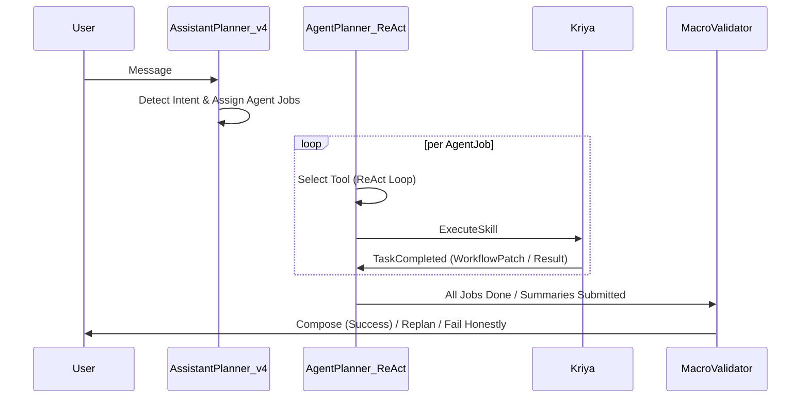

# Architectural Decision Matrix

When designing and implementing a ResMate use case, developers must navigate critical architectural decisions regarding execution models, state management, and tool routing. These decisions dictate the performance, security, maintainability, and auditability of their application:

1. **Single-Agent vs. Multi-Agent Architecture**: How to distribute conversational and task execution responsibilities.
2. **Standard Flow vs. Business Workflow**: Whether to use ephemeral conversational sessions or structured, state-machine-driven business processes managed by Smriti.
3. **JS (V8 Isolate) vs. FaaS (Node/Lambda) Tool Execution**: Where to execute tool handlers based on execution budgets, external libraries, and dependencies.

This document provides high-density comparison matrices, decision trees, sequence flows, state ownership guidelines, ReAct conversational patterns, and anti-patterns to help developers build bulletproof use cases.

---

## 1. Sequence Flow & ReAct Loop Execution Model

Understanding how a user message flows through the platform is essential before writing a single line of code or YAML.

### 1.1 End-to-End Sequence Flow (v4 Default)

The diagram below maps the execution lifecycle of a user request under the `WORKFLOW_ORCHESTRATOR_V4` engine:



1. **Validate & Guardrails**: Session context is loaded. Requests attempting restricted actions are blocked by guardrails and return a secure fallback immediately.
2. **Assistant Planner (v4)**: Reads the assistant's `systemContext`, session history, and scoped agents. Emits structured **Agent Jobs** (e.g., containing `assigned_agent`, `expected_outcome`, and `delegation_brief`). The Assistant **never** selects tools directly.
3. **Agent Planner (ReAct Loop)**: Executes once per job. Scoped strictly to the active agent's `skills[]` array. Each turn, the planner decides whether to `execute_tool`, mark the job as `job_complete`, or `job_failed`. It repeats this until the task is achieved or the turn cap (`AGENT_PLANNER_MAX_TURNS` = 5) is hit.
4. **Argument Resolver (Phase 7.5)**: Before Kriya executes a tool, the platform validates arguments against the tool's schema. If empty or invalid, a resolver LLM attempts to populate them from the conversation context.
5. **Macro Validator**: After all agent jobs complete (or fail), compares the user's original query against the accumulated agent summaries. It decides if the `requirement_met`, if a `replan` is needed (cap: `max_replans` = 3), or if it must `fail_user`.
6. **Compose**: Formulates and streams the final, user-friendly response when the validator approves or encounters an honest system failure.

---

### 1.2 The Three Authoring Layers

Use-case authors must organize instructions across three decoupled layers. Putting the wrong rule in the wrong layer breaks LLM execution:

| Layer | YAML Target | Runtime Role | What to Write Here | What to Avoid |
| :--- | :--- | :--- | :--- | :--- |
| **Assistant** | `systemContext` | **Assistant Planner (v4)** — Routes intents to agents and designs agent jobs. | List of available agents, delegation routing guidelines, cross-agent gates, and high-level scope definitions. | Detailed tool lists, tool step order, or API argument details. |
| **Agent** | `systemInstructions` | **Agent Planner (ReAct)** — Picks and sequences tools within its scoped catalog. | Explicit tool ordering rules, step-by-step logic, and "never-rules" (e.g., HITL before write). | Unstructured instructions or "use tools as needed" phrasing. |
| **Tool** | `systemInstructions` | **Kriya Engine** — Executes stateless actions and verifies input/output schemas. | Argument descriptions, precise conditions on when this tool is callable, and output data types. | Sequencing instructions or rules referring to other tools. |

---

## 2. Single-Agent vs. Multi-Agent Architecture

This decision determines whether a single generalist agent handles all tasks, or if conversational duties are delegated across specialized agents.

### 2.1 Comparison Matrix

| Architectural Dimension | Single-Agent | Multi-Agent |
| :--- | :--- | :--- |
| **Task Complexity** | Low to Moderate. Linear, single-domain tasks (e.g., looking up tickets, editing a field). | High. Cross-system, multi-step business tasks requiring diverse guidelines and permissions. |
| **Cognitive Prompt Dilution** | **High**. A single agent must maintain all instructions and tool specifications, degrading focus. | **Low**. Each specialized agent has a highly focused prompt and a narrow, relevant tool binding list. |
| **Authorization Boundaries** | **Broad & Risky**. The agent must be authorized for all tools, making least-privilege security difficult. | **Narrow & Secure**. Specialized agents only access tools in their domain, establishing natural boundaries. |
| **Routing Overhead** | **Zero**. No inter-agent routing or handoff latency. | **Moderate**. Master Orchestrator must detect intent, schedule jobs, and coordinate handoffs. |
| **Token Cost & Turn Efficiency** | **High per turn**. The entire monolithic prompt (all tools/instructions) is sent to the LLM on every turn. | **Low per turn**. Only the prompt and tools of the active specialized agent are sent, optimizing context size. |
| **Maintenance & Scaling** | Hard. Adding tools or modifying instructions risks breaking unrelated behaviors (regression). | Easy. Agents are modular and isolated; modifying one agent has zero impact on other domains. |

### 2.2 Decision Tree

```text
                       Are there multiple distinct task domains,
                    strict security boundaries, or >5 complex tools?
                                     /          \
                                    /            \
                                  YES             NO
                                  /                \
                       Use Multi-Agent             Use Single-Agent
                     (Specialized Agents)        (Generalist Agent)
```

### 2.3 Architectural Guidelines

- **Choose Single-Agent when**:
  - The use case is completely self-contained and operates within a single system (e.g., "Look up a JIRA issue and display its fields").
  - The total number of tools bound to the agent is small ($\le 5$), ensuring the LLM maintains attention.
  - Minimizing latency is the primary concern, avoiding the minor overhead of orchestrator planning.
- **Choose Multi-Agent when**:
  - The use case spans multiple systems or departments (e.g., "Analyze a PDF, query Oracle, and then open a JIRA ticket for approval").
  - Different stages of the task require distinct behavioral guidelines, compliance boundaries, or clearance levels.
  - You are approaching model attention limits, leading to missed tool calls or ignored system constraints.

---

## 3. Standard Flow vs. Business Workflow

This decision determines whether the use case runs as an ephemeral chat session (Standard Flow) or as a structured, state-machine-driven process (Business Workflow) managed by the Smriti state engine.

### 3.1 Comparison Matrix

| Architectural Dimension | Standard Flow (Non-Workflow) | Business Workflow |
| :--- | :--- | :--- |
| **State Persistence** | **Ephemeral**. State lives in the active chat session memory. If cleared, all state is lost. | **Durable & Persistent**. State is saved in the Smriti database (`workflowInstances`) and cached in Redis. |
| **Database Backend** | Prajna Session Store. | Smriti State Engine (MongoDB) + Redis. |
| **Session Tracking** | Tracked via `session_id`. Ephemeral conversational history. | Tracked via `workflow_id` bound to a session. Survives session restarts and refreshes. |
| **Stage Structure** | **Unstructured**. Driven entirely by LLM conversational reasoning. No formal states exist. | **Structured**. Governed by `flow.yaml` defining explicit stages (`collect`, `agent_task`, `review`, `terminal`). |
| **Reply Policies** | **Static**. Governed by the assistant's general `systemContext` and agent instructions. | **Stage-Specific**. Governed by `playbooks.yaml` which overrides tone, limits, and instructions dynamically. |
| **Audit Ledger Logging** | Basic chat history logs only. | **Immutable Audit Ledger**. Every transition, state mutation, and hook execution is written to an append-only ledger. |
| **Automated Hooks** | None. All actions must be explicitly initiated by the agent's tool calls. | **Automated & Transactional**. Supports `onEntry`, `onHitlSubmit`, and `onSaveSuccess` hooks (mutate, notify, webhook). |
| **State Transitions** | Conversational. Driven entirely by LLM planning. | **Automatic**. Platform auto-advances stages when `doneWhen` conditions (fields or validator passes) are satisfied. |

### 3.2 Decision Tree

```text
                      Is there a formal business process
                     with mandatory states/stages & audit?
                                 /            \
                                /              \
                              YES               NO
                              /                  \
                 Use Business Workflow         Use Standard Flow
               (flow.yaml + playbooks.yaml)    (System Context only)
```

---

### 3.3 State Ownership & Definition vs. Instance

Strict rules dictate how state is managed across the platform.

#### State Ownership Rules
- **Prajna + Smriti** own workflow instances (`inputs` bag, `artifacts` bag, active stage, and active playbook). Use-case authors must **never** write custom workflow state to external databases or Mongo/Redis directly.
- **Prajna Session** owns the active chat history and short-term conversational context. Use-case authors must **never** write "session save" tools to persist data between conversational turns.
- **Tool Handlers** are strictly **stateless**. Handlers perform computation or integration, return a `workflowPatch` to the platform, and exit. Handlers must **never** return an `advanceStage` flag or try to mutate stage indices.

#### Definition vs. Instance Comparison

| Concept | Scope | Saved Location | Modification Action |
| :--- | :--- | :--- | :--- |
| **Definition** | The static structural blueprint of the workflow (metadata, stages, schemas, playbooks). | Smriti Definitions collection (MongoDB). Pushed via `vgen workflow push`. | Edit the workspace source files (`flow.yaml`, `schema.yaml`, `playbooks.yaml`). Each push appends a new immutable version. |
| **Instance** | The active, running state machine created for a specific transaction or user session. | Smriti Instance collection (MongoDB) and cached in Redis. | Never edited directly. Modified programmatically by the platform when save tools return a `workflowPatch`. |

#### State Save Tool Decision Tree
If you are deciding whether a tool needs to write a `workflowPatch`:

```text
Is the assistant workflow-bound (workflow_definition_slug set)?
├─ NO  → No save tools. Use HITL; the next tool reads values directly from context.input.
└─ YES → Does this stage need to save a field declared in schema.yaml?
         ├─ NO  → Agent/tool side-effects only (e.g., search tools).
         └─ YES → Create a save tool that returns workflowPatch.inputs.<key> or workflowPatch.artifacts.<key>.
```

---

## 4. JS (V8 Isolate) vs. Executing in FaaS (Node/Lambda)

This decision determines where your tool handler scripts execute. JS tools run in a lightweight, secure V8 Isolate sandbox on the ResMate platform, while FaaS tools run in a dedicated Node.js container (AWS Lambda or equivalent).

### 4.1 Comparison Matrix

| Architectural Dimension | JS (V8 Isolate) | Executing in FaaS (Node/Lambda) |
| :--- | :--- | :--- |
| **External Dependencies** | **None**. Only standard JavaScript and platform-provided polyfills (`vgen-polyfills`) are available. | **Full npm Support**. Can include any external npm packages via a standard `package.json` file. |
| **Execution Timeout** | **Strictly < 500ms**. Designed for ultra-fast, stateless data transformations and quick queries. | **Up to 30 seconds**. Designed for long-running computations, heavy API integrations, and file processing. |
| **Smriti Secrets Access** | Direct and secure via the `getSecret` platform polyfill. | Indirect. Requires secure environment variable injection or API gateway mapping. |
| **Cold Start Performance** | **Near-Zero (Sub-millisecond)**. Isolates are extremely lightweight and spin up instantly. | **Variable (100ms to 3s)**. Subject to container spin-up latencies and network attachment delays. |
| **Memory Footprint** | Extremely low ($\le 128\text{MB}$). | High (configurable, typically $256\text{MB}$ to $1024\text{MB}$). |
| **Deployment Complexity** | Low. Handlers are pushed directly as plaintext scripts in the `tool.yaml` bundle. | Moderate. Requires compiling, bundling dependencies, and deploying to a container registry or Lambda. |

### 4.2 Decision Tree

```text
                      Does the tool require external npm packages,
                     heavy file processing, or run for >500ms?
                                     /          \
                                    /            \
                                  YES             NO
                                  /                \
                             Use FaaS            Use JS Isolate
                          (Node/Lambda)           (V8 Sandbox)
```

### 4.3 Architectural Guidelines

- **Choose JS (V8 Isolate) when**:
  - The tool performs basic data mapping, validation, or simple REST API calls using standard fetch.
  - Execution speed is critical, and you want to avoid cold-start latencies.
  - The tool relies on platform-native data access, such as querying Smriti records via `queryRecords` or fetching write-only secrets via `getSecret`.
- **Choose FaaS (Node/Lambda) when**:
  - You must import external npm libraries (e.g., `pdf-parse` for document extraction, `lodash`, or specialized SDKs like `@aws-sdk/client-s3`).
  - The integration involves heavy computation, file manipulation, or slow third-party API endpoints that take longer than 500ms to respond.
  - You need to run complex multi-step integration scripts that require their own isolated execution environment, file system access, or network configurations.

---

## 5. Conversational ReAct Patterns

ReAct (Reasoning and Acting) loops execute in multi-turn environments. Use-case authors must adhere to these six battle-tested patterns to ensure stable conversations.

### Pattern 1: The HITL Two-Step (Confirm Before Side-Effect)
When running write operations or sensitive queries, always display a Human-in-the-Loop (HITL) card for parameters confirmation before executing the action.

- **Rule 1 (Naming)**: Any tool that returns an Adaptive Card configuration must have its name end with **`HITLConfig`** (e.g., `oracle-pr-vendor-HITLConfig`).
- **Rule 2 (Turn Separation)**: The agent's instructions must strictly state: **"Never execute the write/action tool on the same turn as the HITLConfig tool"**. The platform must pause to await user submit.
- **Rule 3 (Action Constraint)**: The action/write tool's system instructions must explicitly declare: **"ONLY call this tool after the user has submitted the HITL form"**.

---

### Pattern 2: Modular Multi-Agent Routing
When an assistant coordinates multiple agents, separate routing rules from tool sequencing.

- **Rule 1 (Assistant Scope)**: The assistant's `systemContext` contains a routing table mapping user intents to specific agent slugs. It **never** names individual tools or detailed step instructions.
- **Rule 2 (Agent Scope)**: The agent's `systemInstructions` define the precise tool execution order and domain-specific step guidelines.

---

### Pattern 3: State-Machine Gate Fields (Optional Contracts)
Tools can return structured, custom state fields (gates) to instruct planners when to halt or proceed.

- `kbReady`: Set to `true` when semantic index mapping or prerequisites are met.
- `nextAction`: Set to `stop` or `continue` based on validations.
- `userMessage`: Carries clear, friendly instructions when a gate fails.

*Note: These are conversational design conventions documented in your agent instructions, not platform-enforced types.*

---

### Pattern 4: Handoff presentation with `agentResponseContext`
To prevent prompt dilution, avoid writing massive text-formatting rules in the agent instructions. Instead, have your tool handlers return an `agentResponseContext` string in their JSON payload. This instructs the planner exactly how to present the result.

```json
{
  "success": true,
  "records": [...],
  "agentResponseContext": "Summarize the matching vendors in a clean markdown table. Emphasize their active status."
}
```

---

### Pattern 5: Unified Proceed / Continue Routing
When users say "proceed", "continue", or "go ahead" after a HITL form or informational block, the assistant's system instructions must specify:

1. How to look back in the conversational history to resolve the **original intent**.
2. Which agent owns the resumption (typically the agent that initiated the setup).
3. What **not** to do (e.g., never route a "proceed" message to a different, unrelated agent).

---

### Pattern 6: Direct execution (No-HITL Bypass)
Bypass HITL forms only for safe, non-destructive read operations (such as listing available document templates or syncing metadata on explicit user request). Document these explicitly as **Direct (No-HITL)** in the agent's instructions.

---

## 6. Architectural Anti-Patterns

Avoid these common pitfalls which degrade agent reasoning, exhaust token budgets, or cause execution failures:

| Anti-Pattern | Why It Fails | Correction |
| :--- | :--- | :--- |
| **Tool Sequencing in Assistant** | The Assistant Planner (v4) does not see tools. It only coordinates agents, so listing tools here is ignored. | Move tool execution guidelines to the specialized Agent's instructions. |
| **Same-Turn HITL & Action Execution** | The agent calls the action tool in the same turn it loads the card, executing before the user can submit details. | Add a "never-rule" to the agent's instructions, forcing turn separation. |
| **Vague Agent Instructions** | "Use tools as needed to complete the task" causes the planner to exhaust its maximum 5-turn budget. | Write concrete, step-oriented instructions mapping out exactly when to run each tool. |
| **Custom DB State Duplication** | Storing workflow state in third-party databases or duplicating bags in custom session stores leads to state drift. | Rely exclusively on returning `workflowPatch` payloads. Let Prajna and Smriti manage workflow state. |
| **Monolithic "Mega-Agent"** | Binding $\ge 10$ tools to a single agent dilutes prompt focus, causing the model to skip validation rules. | Split the use case into multiple specialized agents coordinated by a Master Assistant. |
| **Missing HITL in Guardrails** | Standard guardrails block form submissions, preventing the user's submit payload from reaching the agent. | Ensure the assistant's `guardrailsContext` explicitly permits HITL form submission pathways. |
| **Orphan Skill IDs** | Declaring a tool ID in the agent's `skills` array that has no corresponding folder in `tools/` breaks CLI validations. | Clean your agent's YAML file. Only list tool IDs that are actively developed in the workspace. |
